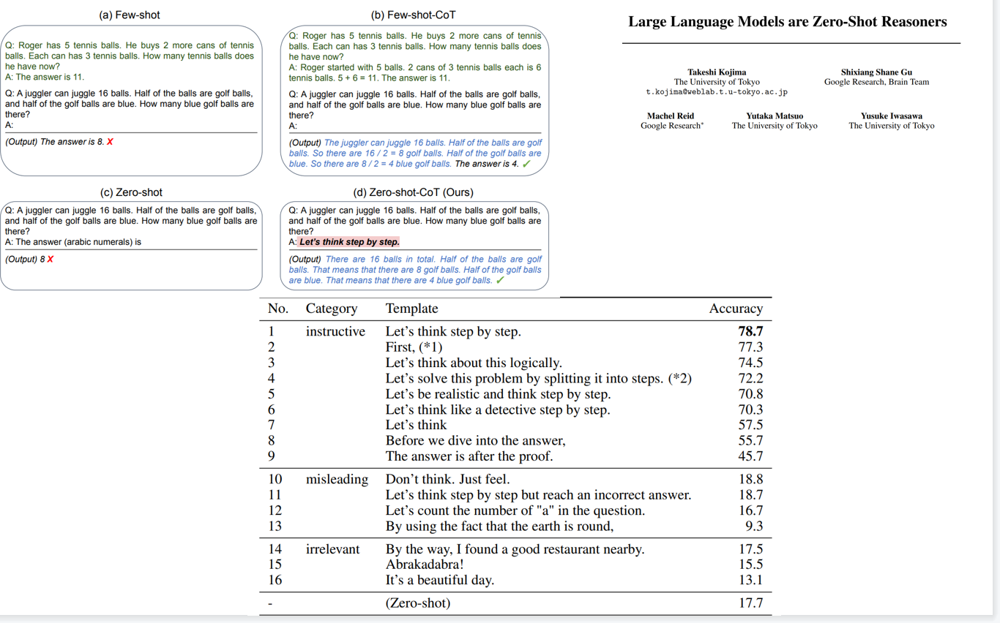
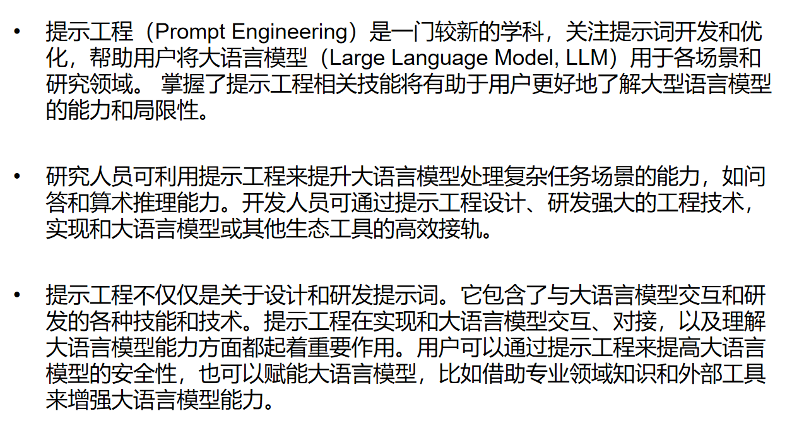

# 大语言模型

## 如何评测大语言模型？

### 评价数据集

NMLU:

CNMLU:

CEVAL:

现在很难有一个统一的标准，因为每个人关注的点都不一样。

> 究竟是评估模型的知识量，还是模型的结构。不同的模型结构和训练数据都不一致，很难公平的评估。
>
> 
>
> 为什么采用选择题的形式进行测试？
>
> 避免直接生成答案后还需要评估生成文本和正确文本之间的差距

### 人工评价

### GPT4的评价

优点：自动

缺点：对事项性的判断较差，对生成结果的形式判断比较依赖，而忽视生成文本的质量

## 关于大模型的可解释性的研究

### 研究背景

Q: 大模型只做训练预测下一个词，那模型到底学到了什么？

仅仅是词之间的概率统计?

or

真实世界知识（world model)

白话：模型到底知不知道中国在哪，还是只知道中国和美国等是类似词

### 研究方法：Probing 探针法

1.让模型输出某一实体（如中国）的表示向量

2.以表示向量为特征，训练浅层模型（如线性回归）来拟合某一个与输入实体相关的信息（如经纬度）

如果能够拟合，则说明特征有效，即模型给出了合理向量表示，或者说学到了这方面信息

如果不能拟合，则说明特征无效

文中使用线性回归

### 数据集

构造了6个数据集

地理位置相关3个，拟合经纬度

时间相关3个，拟合年份

### 结论

输出的地址文本表示和地址表示存在线性相关

### 研究意义

这些有什么用？

一旦我们能够了解语言模型的工作原理，就能很容易地判断一个模型是否安全，从而决定它是否应该被社会和企业所采用。

而通过人为地刺激其中任一特征，就能引导模型给出我们预期之内的输出。

比如开启DNA特征就能使模型输出DNA，开启阿拉伯文字特征就让模型输出阿拉伯文字。

## 大语言模型的训练步骤：

1.基座语言模型

2.数据集微调

3.文本匹配方式训练打分模型

4.依据打分模型的结果进行强化学习

Cursor ：代码补全

## In-context-learning

#### ICL与传统机器学习

传统机器学习的关键是通过真实值与预测值之间的差距，进而得到梯度，最后沿着梯度的反方向进行权重的更新。这一过程就是模型学习数据规律的过程，其中最最要的就是权重的更新，没有权重更新之前的计算就没有意义，模型参数也不会发生调整。

而ICL是在模型的前向计算的过程中进行的，也就是没有进行梯度的更新，但是也学习到了规律，这就很不合理。

#### ICL的优势

#### ICL的相关研究

z-s,o-s,f-s属于ICL

chain-of-thought（思维链）属于ICL

在输入中加入至少一个样本，能大幅提升ICL效果

fine-tune会伤害ICL

精巧prompt设计有可能超过os,fs

Magical word

ICL时输入错误样本，不一定影响准确率

ICL可以压倒先验知识

ICL可以压倒先验知识也就意味着它可以像传统的模型一样直接学习样本规律，哪怕是与预训练的知识相违背。

结合上一篇的观点，给出随机的样例模型的结果不会产生太大影响，但是这篇的观点是给出违背先验知识的样本，可以学到这种规律，这两个观点某种程度上是相反的。

ICL成因的两种看法

ICL要点

fine-tune vs ICL

## 提示工程相关

> 类似搜素引擎

### 基本介绍

> ICL算是提示工程的一部分。
>
> 1.不具备可解释性
>
> 2.对prompt敏感，输入稍微改变一点，输出的结果差距可能会很大。这是是否由于模型未充分训练导致的，因为相似的表达在语义上是相似的，应当输出相同的结果，至少不会产生大幅度影响。
>
> 但并不一定是这种情况，因为对语言来说存在一定的特殊表达的情况，这种固定的表达形式如果改变一点就会改变原来表达的含义，就是说在训练数据中这种固定的搭配影响着模型的输出结果，一旦发生改变就会让模型脱离原有的表达方式，模型对语言的改变过于敏感（但是我认为这种情况的出现概率是很小的，不应该大范围的影响结果）。
>
> 3.不同的采样策略会有不同的结果，但是如果模型权重固定，采样策略固定，它的输出结果必然是相同的

> 注意事项
>
> •1.安全问题
>
> ​    目前网上的许多类chatgpt项目是以接口方式提供服务，输入问题都会被发送到对方服务器，需要注意数据安全
>
> •2.可信度问题
>
> ​    1)语言模型的生成结果本身具备一定随机性
>
> ​    2)语言模型可以生成完全错误，但看起来通顺的文本
>
> •3.时效性与专业性
>
> ​    脱离网络的语言模型受制于训练数据的时效性，在细分专业领域的回答受数据质量和数量限制

### 提示工程 prompt engineering

### 应用场景

在自己能够验证结果的正确性与真实性的工作中可以使用，不建议在自己完全不了解也无法快速验证的情况下使用。

### 使用技巧

#### 相关参数设置

#### 合理使用分隔符

#### 给模型拒识出口

#### 要求结构化输出

会受到token限制导致模型的输出结果不完整，或者是输出的内容很复杂也会生成json失败

拆解任务步骤

#### 利用一些法则

#### 让AI自己提问

## 智能体

通过prompt定义一个Agent的身份、目标、输出、约束等内容，让多个Agent通过各自的输出交互，合作完成任务

## 模型结构

240108

### 多头共享机制

> 传统的多头机制
>
> transformer模型在self-attention中将输入特征切割成多份，假设经过embedding层后的特征是10*768，会被切分成12个head，每一部分是10 * 64 ，作为一个单独的文本表示，分别与qkv3个线性层相乘，计算self-attention，再合并回成原来的10 * 768 的完整文本表示

但是传统方式的问题是计算量大，需要计算多个QKV，于是有以下的改进方法，减少K和V的参数，（Q代表输出，一般不缩减）（为什么Q代表输出？）

1.Grouped-query

(LLAMA)，将Q分为N组，一组Q使用同一个K和V，

2.Multi-query

所有Q只使用一个K和V（ChatGLM）

### Attention结构

GPTJ结构，平行放置attention layer和feed forward layer

moss, palm用的这种结构，目前不算太主流

### 归一化层

> RMSNorm 倒数平方和

### 归一化层位置选择

> 传统是在残差之后做归一化，现在有提前归一化、前后都做归一化的做法

### 激活函数

> 原始的机器翻译中的attention使用的是 relu , Bert使用的是gelu，现在使用多的是 swish

### LLAMA2的整体结构

> 主要的不同在llama的前馈层
>
> > 前馈层在transformer中主要是接收atten的输入，增加模型对复杂过程的拟合能力，主要由两个线性层和激活函数组成
>
> 这里的使用先用两个线性层一个经过激活函数一个不经过，再对两者的结果进行点乘（类似LSTM中的门控机制），最后再经过一个线性层

## 相对位置编码

### 位置编码的意义

> 位置编码的意义：
>
> 由于transformer中使用的都是线性层，编码过程中没有明显的位置信息，对于字词位置的交换，仅相当于矩阵中的位置交换，这带来并行计算的优势，但是也弱化了语序信息，（仅仅交换位置会导致后面再做池化时不同语序的文本表示是相同的）因此需要引入位置编码来弥补

### 文本长度外推性

>在原始的transformer中位置编码是固定的，不同位置对应不同的位置向量，在Bert中有位置编码是可学习的，但是学习到的仍然是固定的位置编码，这种位置信息已经能够满足不同语序的文本表示不同的需求，但是，人们希望更进一步让模型能够满足长度外推性。
>
>> 预测时序列长度比训练时候长，模型依然有好的表现，称为有较好的长度外推性
>>
>> 比如：训练样本最大长度512，预测过程输入样本长度1024
>>
>> 长度外推性是一种理想的性质，并非是必要的

### 目前主流的位置编码方法

#### 正余弦位置编码

理论上，使用固定公式计算的位置编码可以预测时输入比训练时更长的文本位置编码，但是更长位置编码在训练时没有接触过，预测时实用的效果不好

#### 可学习位置编码

一般称为position embedding，以Bert为代表，如同token embedding一样，随机初始化之后，靠梯度反传学习调整，缺点在于无法外推，需要预设最大长度。这个预设的长度的上限在预训练时已经被设置了，当输入的文本长度超过512后，position embedding就无法分配位置编码

#### RoPE相对位置编码

旋转式位置编码（Rotary Position Embedding）

> 旋转式位置编码（RoPE）提出的一种能够将相对位置信息依赖集成到 self-attention 中并提升 transformer 架构性能的位置编码方式。而目前很火的 LLaMA 模型也是采用该位置编码方式。
>
> 原理是在原始的token embedding中施加一个和三角函数有关的映射，对QKV分别施加这种变化，这样qk在做乘积时就会和原来的Qm和Qn以及m和n之间的差值有关。相当于在原始的编码上套了一层函数，实现了相对位置编码的效果。
>
> 最终实现的效果：在计算self-attention时既包含了一个token相对于另一个token的文本表示信息，也包含了两者的相对位置信息。这种做法就不再需要一个额外的position embedding，在预测时即使长度超过训练时的文本长度，但是文本之间的相对位置是学习过的，可以达到文本长度外推性

> 缺点：随着距离变长，位置编码的能力自动衰减，编码的差值在逐渐减小。如果两个字之间的距离太远，就会弱化transformer的长距离依赖的能力，出现了类似RNN的性质（原始的transformer计算第一个token和最后一个token之间的注意力分数，和计算第一个token和第二个token是没有区别的，这也是transformer优于LSTM的地方之一，另一个是可以并行计算）

#### Alibi位置编码

> 在q * k 矩阵上加上一个相对位置矩阵，简单

> 长度外推性只是锦上添花，过长的文本还是需要预先的处理。但是原始的Bert来说，绝对位置编码不能处理超过512长度的文本，相对位置则没问题，至少可以输出结果
>
> 还是要以能看懂开源代码为主，不要机械的记忆

## 多模态

### 模态

•常见：

•文本、图像、音频、视频、表格数据等

•罕见：

•3D模型、图数据、气味、神经信号等

> 不同模态，对于计算机而言都是相同的信息

### 多模态意义

1.许多现实任务是天然的多模态任务

2.加入不同模态有助于模型提升表现

3.更加灵活的使用方式和广阔的应用场景

> 图片信息能够辅助语义的理解

### CLIP文本和图像的交互

> 文本编码器和图像编码器的结果进行处理得到一个结果，让这个结果拟合标签，下面介绍图像编码器

### ViT 图像编码器

> 图像的transformer

> 图像是一个天然的矩阵，可以直接进行编码，但是transformer处理的是序列信息，于是就有想法将图像也处理成序列的形式，对图片切片，然后为切片后的图片进行位置编码，将其转化为类似文本embedding后的结果，n*768的矩阵
>
> 模型只是一个矩阵，对输入具体是什么没有要求

### 文本和图像信息的交互

#### 在attention计算中交互

> 文本的注意力得分是文本本身的编码*文本本身的编码，类似可以使用文本编码 * 图像编码 计算注意力得分，即图像的每一块 与 文本的每一个字计算注意力，q和k分别来图片和文本
>
> 但是这种交互需要的数据量很大
>
> 相关代码：otter项目

#### 简单的融合

> 将文本和图像的编码结果直接进行拼接
>
> 相关代码：LLaVA项目

### 小结

•多模态目前想落地目前还不算完全成熟，效果不够理想。部分场景、部分任务上可用

•未来前景很大，使用场景广阔，是一个重要的方向

## 模型训练

> 在训练资源有限的情况下，采用局部参数微调的方式，提升下游任务的效果

### Prompt Tuning

> 为不同的任务拼接不同的token，在训练过程中只训练拼接的token，模型参数不动，这些token是随机初始化的

### Prefix-Tuning

### P-Tuning

> 在每一层的transformer中都拼接上一部分token，可训练的参数更多一些

### LORA

>用两个2 * 768 的矩阵代替 768 * 768 的矩阵，矩阵的低秩分解，理论上所以的线性层都可以使用，在实际上是作用在attention的q和v
