## 文本分类

### 贝叶斯算法

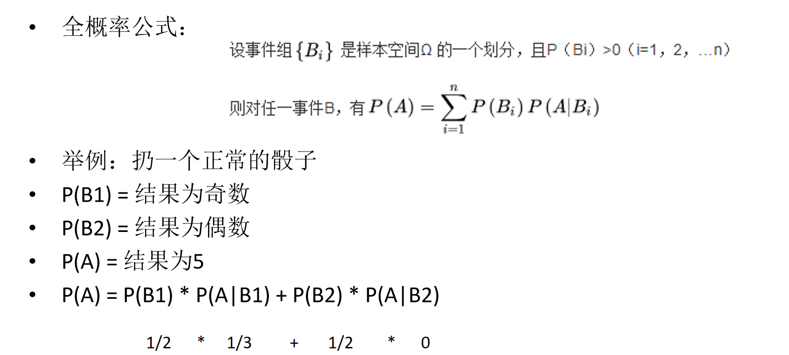

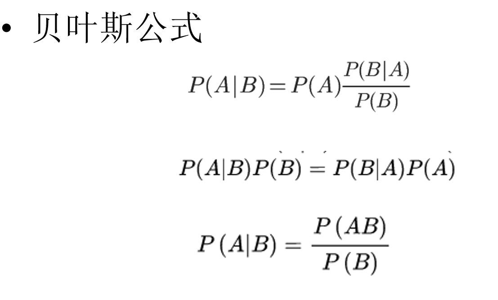

#### 贝叶斯的应用

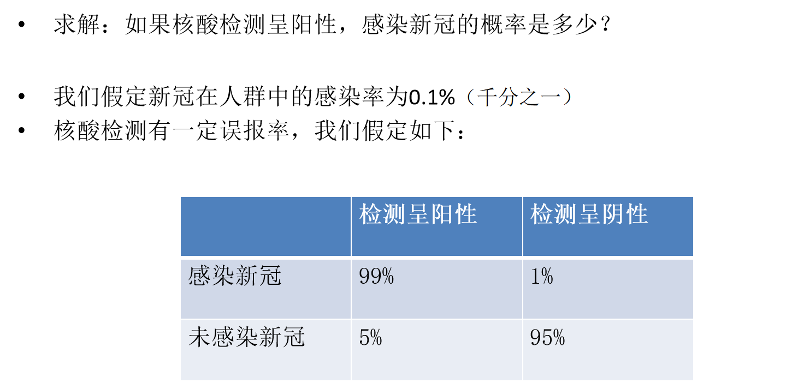

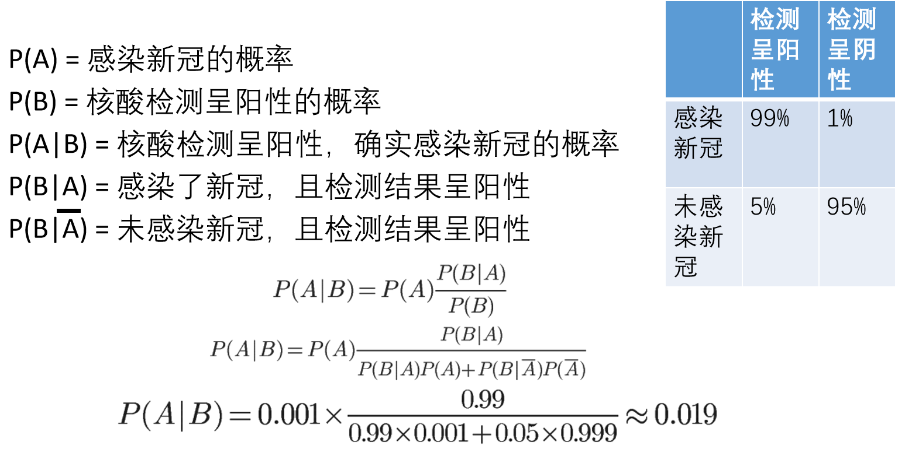


#### 贝叶斯在NLP中的应用

根据文本包含的单词判断文本的类别

#### 

```
P(A1)、P(A2)、P(A3)分别表示A1，2，3类别在数据集中的出现概率

P(W1,W2...Wn|A1) 是表示假设一篇文章是A1类别，出现w1,2,3..n这些单词的概率（是都出现吗？是的，是同时出现），但是这个概率是很难计算的

所以出现了词的独立性假设
P(W1,W2...Wn|A3)=P(W1|A3) * P(W2|A3) ...P(Wn|A3)
即，单词同时出现的概率和他们分别出现的概率相乘的结果一致的，假设单词的出现是独立性事件（但是这很显然有问题，单词与周围的上下文是有关系的），对问题的简化，是一种无可奈何的妥协，如果严格按照定义计算，得到的结果大部分都是零，因为只有这篇文章中才会出现这些单词的组合
P(W1|A3)很好计算，只需要统计A3类别文章中W1出现的概率
未出现的单词设计为一个很小的值

P(W1,W2...Wn)，作为分母，使用全概率公式计算，根据A1类别中W1,W2...Wn出现的概率（P(W1,W2...Wn|A1)） + A2类别中W1,W2...Wn出现的概率P(W1,W2...Wn|A2) + A3类别中W1,W2...Wn出现的概率P(W1,W2...Wn|A3)

相关代码 bayse.py
原代码只考虑到文章的标题，尝试将文章的内容也加入考虑范围

缺点：
1.样本分布不均匀会影响先验概率，影响P(A1)、P(A2)、P(A3)
2.未出现的单词的特征或样本，概率为零，可以通过+1引入平滑
3.忽略单词之间的关联，如 苹果手机
4.没有考虑语序的影响，我打你，你打我，对短文本影响大，长文本的语序影响较小，也没考虑词义（向量化，异形同义词的概率应该是要累加的）

优点：
1.简单高效，只需要统计文本信息
2.一定的可解释性，（神经网络做不到），可以将预测结果的计算过程展示出来，如查询哪个词该判断结果的贡献最大，
另一方面也可以根据单词的概率反映出统计数据中不合理的地方，适当增加某一类别的数据样本，或者直接指定某一类别单词的概率，通过这种方式来增加贝叶斯分类方法的准确率（这是神经网络方法做不到的），主打一个可定制
3.训练数据的量足够大时，准确率是有保障的
4.训练数据可以分批计算，先计算某一类别再计算另一种类别都是可以的
```


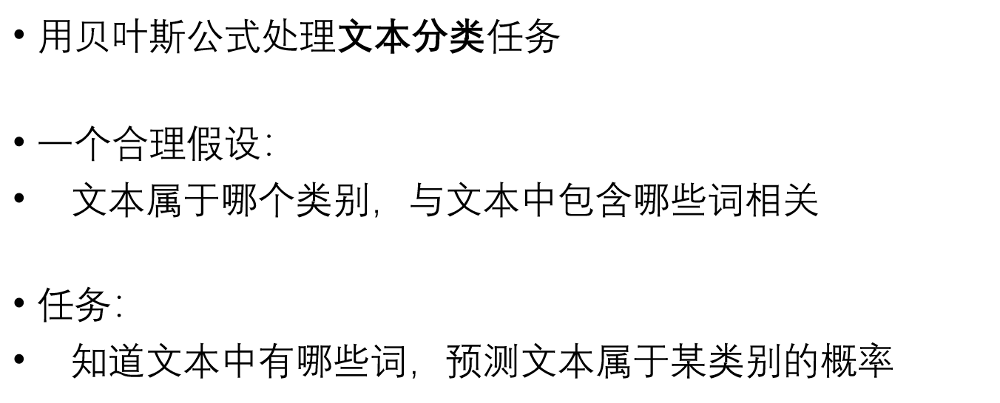

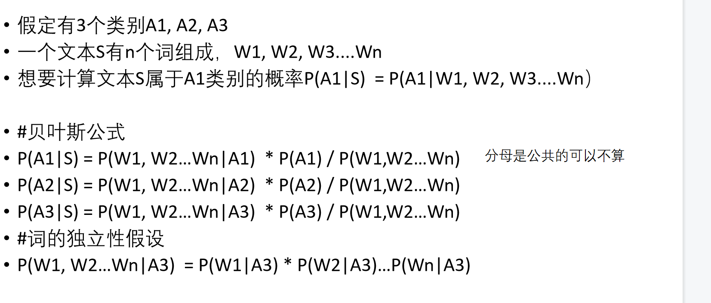

#### 贝叶斯缺点

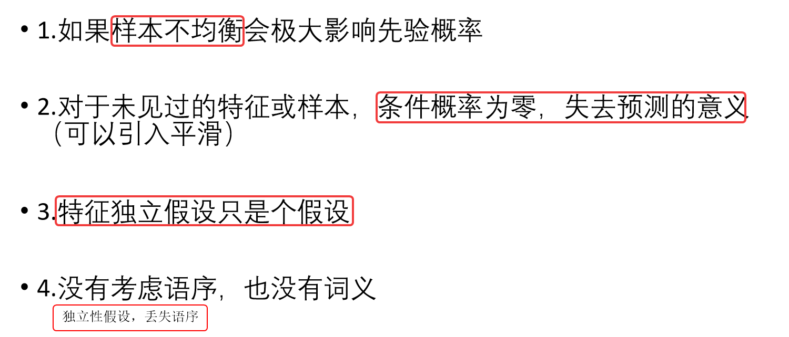

#### 贝叶斯优点

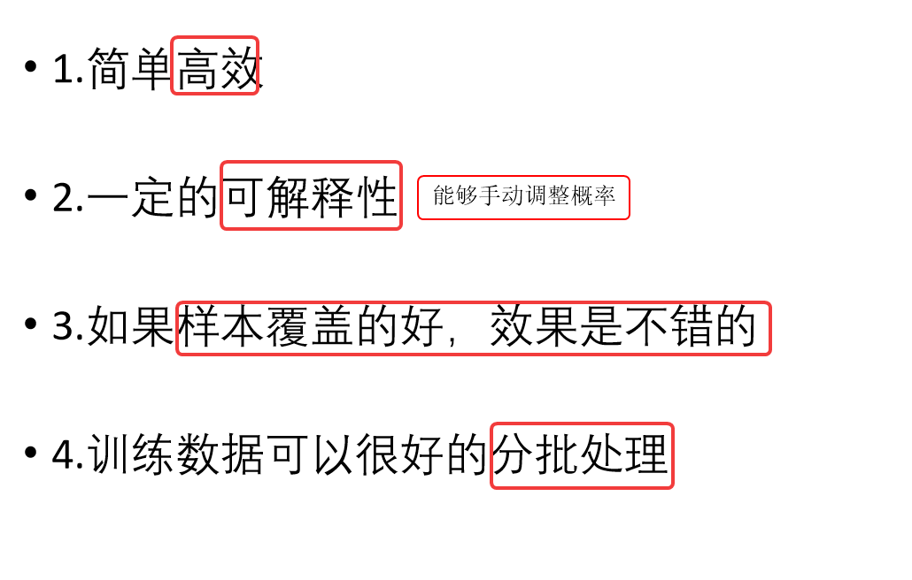

### 支持向量机

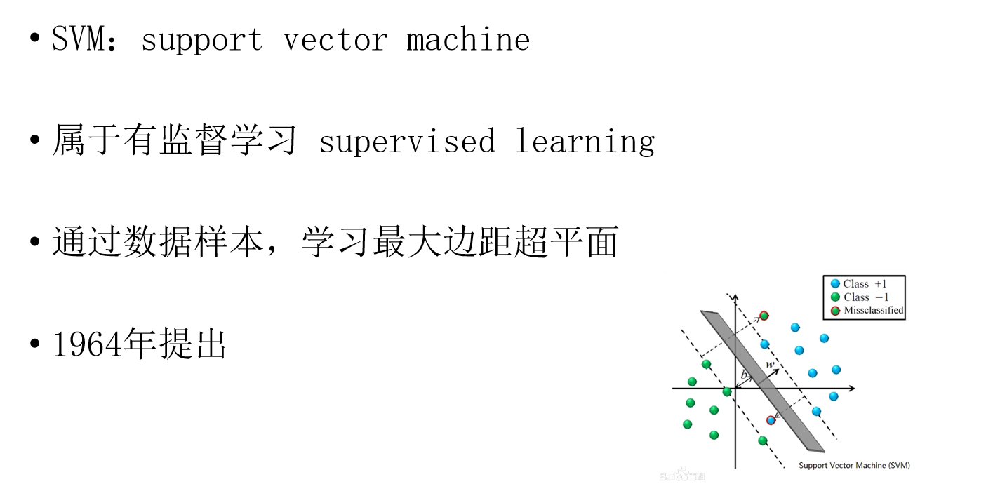


```
1
2000年左右是比较重要的算法。

逐渐被深度学习替代

找到一条线区分不同颜色的物体
这条直线就是一个分类器，将一个物品代入这个直线，根据结果在直线的上下，来确定类别
```


```
2
能够区分物品类别的直线有很多条，需要选择一条最佳的直线
这条直线需要满足：
距离两种不同类别的边界点距离和最远的线

不同类别的边界的点称之为支持向量，这些支持向量需要尽量的离切割平面远，切割平面称之为决策平面，希望找到离支持向量之间距离最远的切割平面

1.首先需要找到支持向量
2.找到最大间隔，学习的目标就是最大化间隔
```


#### 线性不可分问题


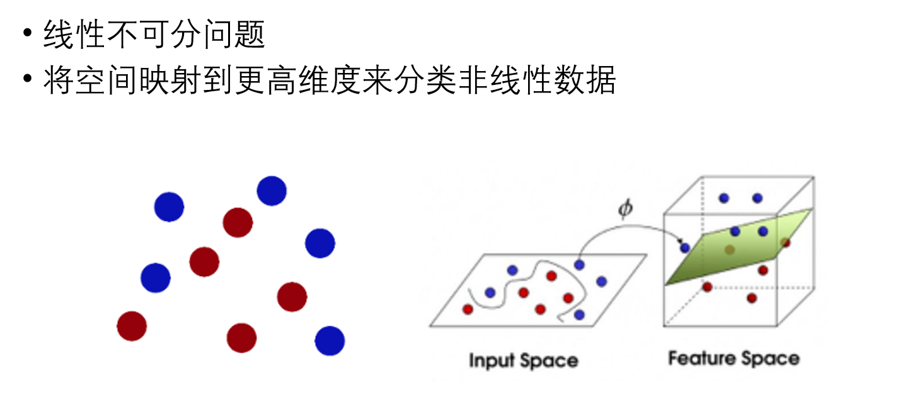


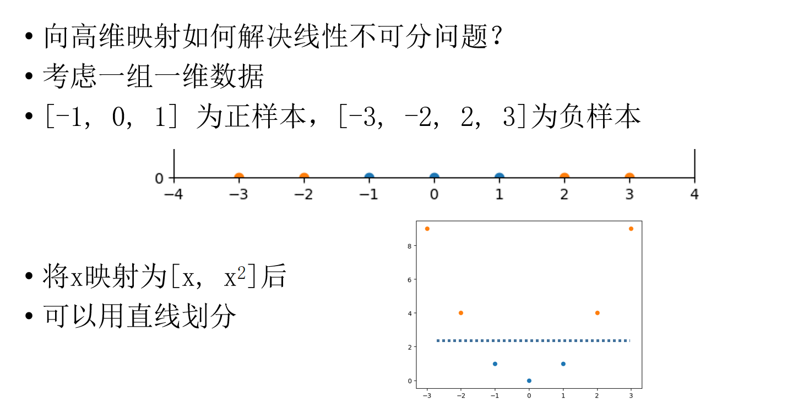

```
为解决线性不可分问题，将空间映射到更高维度

映射为高维空间的思想在深度学习方向也同样适用。

更大的隐单元个数理论上会获得更好的学习能力
```


#### 核函数

```
将低维映射到高维的函数

选择不同的核函数(不同的映射到高维的方式，相当于不同的神经网络结构)进行计算，最优化问题
```


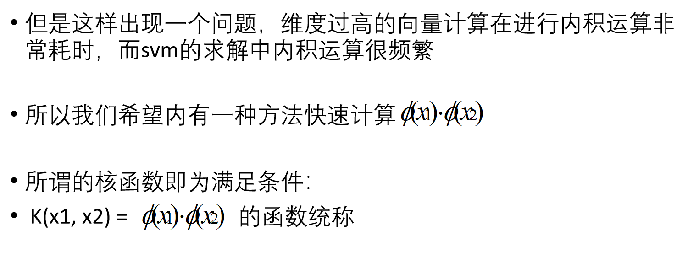

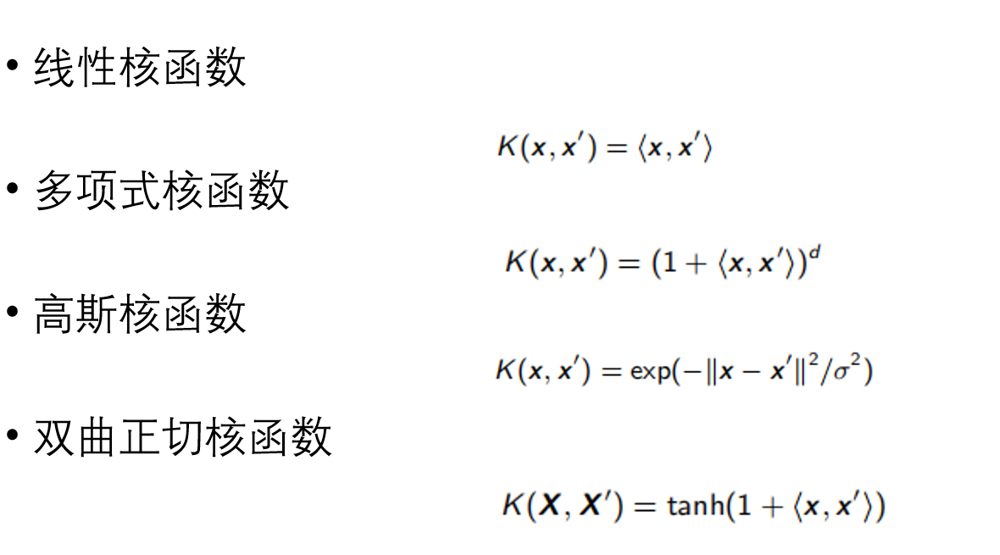

#### 多分类

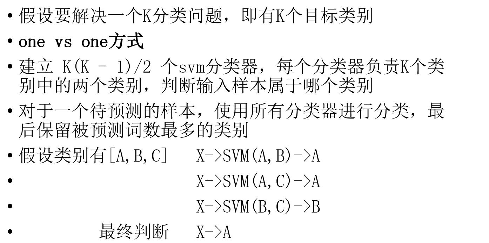

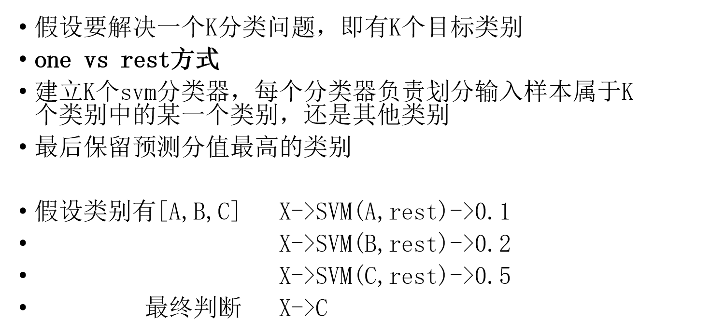

```
语言模型解决分类任务也是这种思想。
需要注意的是，使用svm前需要将输入转为向量
code
svm.py
```


#### 优点

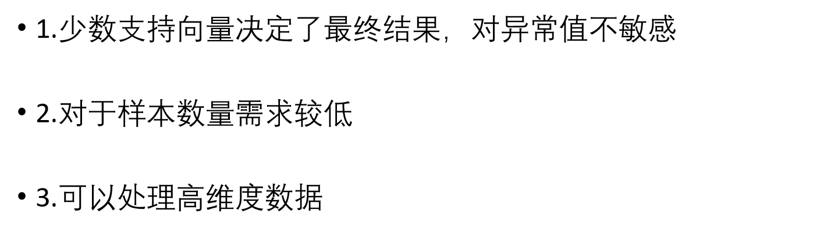

#### 缺点

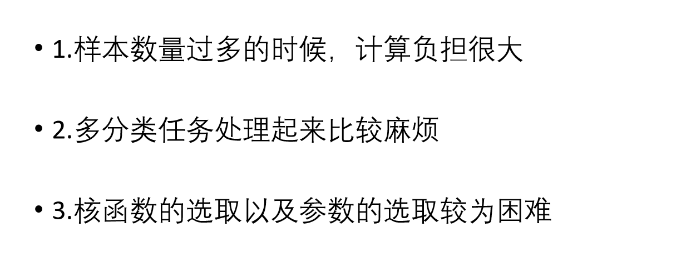

```
svm的词向量不能在训练中更新，如果词向量不适配下游任务，svm的效果就不好，但是在神经网络的训练中词向量会在训练的过程中进行更新

什么时候适合使用SVM
1.对输入SVM的向量很有把握，这里的向量不单单是指NLP任务中的词向量，在其他机器学习任务中，对输入特征的提取很全面，这时使用SVM的效果好；而神经网络的优势在于这些提取的特征可以是随机初始化的，在训练的过程中不断迭代

算法工程师的工作流程
1.定义问题类型
2.设计算法，对比实验效果
3.部署模型，根据上线的反馈效果，对模型进行调整
```


### 深度学习

#### pipeline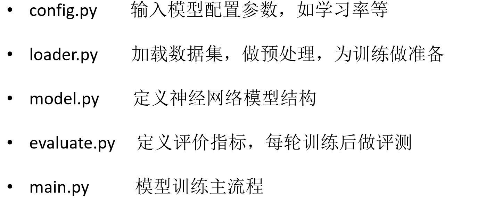

```
代码
nn_pipeline
```


#### 文本分类方法

##### fast Text

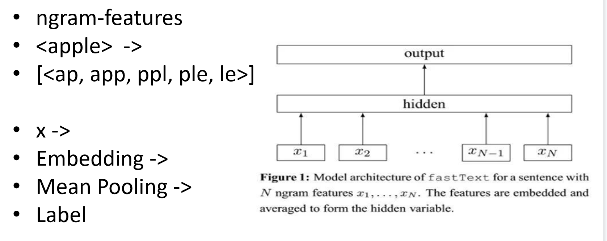

```
ngram-features:
这种切词方式是为了解决英文单词后缀太长，导致词表范围太大的问题，切割成3个字符，会降低词表的大小

fasttext流程：
1.切词
2.将单词对应的切分结果转化为向量
3.求这些向量的平均池化结果
4.输入分类层得到预测结果

训练参数是Embedding层（词表大小 * hidden_size）和分类层 （hidden_size * label）的参数

高效，难度低的文本分类

中文的处理方式可以采用字词混合的输入的方式，增加语序信息
如，文本是：你好....，输入顺序是：你，好，你好，...,这种做法避免了单独输入字符在Polling时丢失的语序信息，一定程度上

浅层神经网络，类似词向量的训练，输入每个字的向量，再求平均，再经过分类层，经常将其作为基线模型。可以用来检查数据的标注质量。
```


##### Text RNN

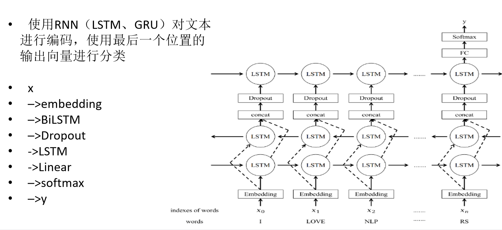


```
输入10 * 256（10：文本长度, 256：词向量维度）的向量，经过rnn得到10 * 512矩阵（10：文本长度，512：隐单元个数），取该矩阵最后一个字1*512的向量（因为最后一个字包含了前面N个字的信息）再输入分类层（10类，512 * 10），得到1 * 10 的向量，每个维度代表属于哪个类别的概率。

语言模型的本质是计算成句概率
```

**RNN结构**


```
RNN的输入为一段文本序列，其中xt-1,xt,...,分别代表输入文本的一个字，假设 input_size = 256 , hidden_size = 128 ，文本长度为128，则：

输入 x = 1*256, RNN隐藏层 S = 1*128 , 完整的输入为 128*256 ，经过RNN输出为 128*128

U为输入层到隐藏层的权重，256*128，将x变换为s的形状方便计算
W为上一时间步的隐藏层s t-1 到当前时间步隐藏层 s t 的权重，128*128，全连接层，形状不发生改变
V是当前时间步的隐藏层s t 到输出层（就是分类层）的权重，128*label，O t 表示输出结果
隐藏状态在不同时间步的推导公式是：
St = f(U*Xt + W*St-1) Xt表示当前时间步的输入，St-1表示前一时间步的隐藏层结果
输出的公式是：
Ot = g(V*St) 

但是这里明显的问题是，随着文本长度的不断增加保留之前输入信息的隐藏层S的大小不变，容量不变，这会导致前面输入的信息的逐渐丢失；
解决的办法：
1.每次输入X,都增加S的大小，
2.有选择的保留输入信息，

很显然，随着文本长度增加无限制的增加S的大小是不现实的，S的大小必须是固定的值
只能通过有选择的保留输入信息来解决S容量不够的问题

LSTM就是采用第二种方式
```


**LSTM结构**


>lstm包含两个状态：隐藏状态（hidden state, h）和单元状态（cell state, c）
>
>>这里面我认为h和x的形状应该要保持一致，不然没办法和相同的w相乘，但是其实这里是简写的w*(h,x)应该要拆分成w * h + u * x ,还需要注意的是pytorch中把这4个公式中的w合在了一起，u也合在一起，只有一个W和U
>
>1.时间步t的隐藏状态$h_t$由t时刻的单元状态$C_t$选择部分内容输出(经过输出门)得到 ，输出门$O_t$由前一时间步的隐藏状态$h_{t-1}$和当前的输入$x_t$，拼接再与输出权重$W_f$相乘，经过$\sigma$激活函数得到
>
>>这里与RNN不同，RNN只有一个h表示隐藏状态，这里有一个C，h是C再经过输出门得到的
>
>$$o _ { t } = \sigma ( W _ { 0 } [ h _ { t - 1 } , x _ { t } ] + b _ { 0 } )$$
>
>$$h _ { t } = o _ { t } * \tanh ( C _ { t } )$$
>
>2.时间步t的单元状态$C_t$由前一步的单元状态$C_{t-1}$遗忘部分内容 和当前时间步的候选状态$\tilde{C}_{t}$保留下的部分内容组成
>
>$$C _ { t } = f _ { t } * C _ { t - 1 } + i _ { t } * \tilde{C}_{t}$$
>
>3.在时间步t，lstm首先决定哪些信息是需要从单元状态$c_t$中丢弃，这一处理过程由2部分组成:
>
>​	3.1.计算遗忘门$f_t$,$$f _ { t } = \sigma ( W _ { f } \cdot [ h _ { t - 1 } , x _ { t } ] + b _ { f } )$$,
>
>​	输入为前一个处理单元的隐藏状态$h_{t-1}$和当前处理单元的输入$x_t$，输出为一个0到1区间的值，0表示完全	丢弃，1表示完全保留;
>
>​	3.2.计算$f _ { t } * C _ { t - 1 }$，将当前的输入与上一步的隐藏单元保留信息进行比较，决定丢弃哪些信息，$\sigma $的作用是	将结果映射到01之间，可以当作权重使用，将这个遗忘权重作用在上一个时间步的单元状态$C_{t-1}$上$f _ { t } * C _ { t - 1 }$
>
>4.然后lstm决定哪些信息需要存储在单元状态。这一处理过程由3部分组成：
>
>​	4.1计算输入门$i_t$，$$i _ { t } = \sigma ( W _ { i } \cdot [ h _ { t - 1 } , x _ { t } ] + b _ { i } )$$和之前的方法一样
>
>​	4.2.计算$\tilde{C}_t$，$$\tilde{C}_t = \tanh ( W_c \cdot [ h _ { t - 1 } , x _ { t } ] + b _ { c } )$$，这种计算方式和RNN计算hs的方法类似
>
>​	4.3.计算$i _ { t } * \tilde{C}_{t}$


> LSTM与RNN是同一类型的模型结构，但是隐藏状态保存的终究是有限的，效果不如self-attention的文本长度*文本长度矩阵
>
> LSTM相当于使用多个RNN当作门，来控制一个RNN

> 简单的文本分类任务仍然可以使用LSTM，预训练的模型能够有更好的效果但是训练的成本更高，带来的提升并不明显

##### Text CNN

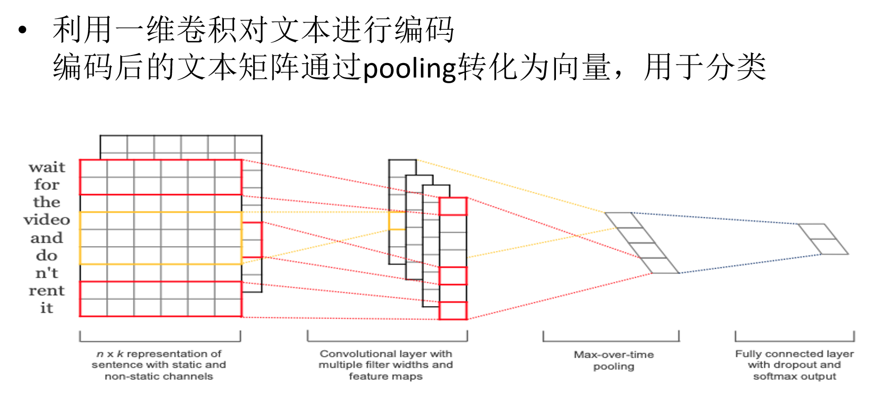

> 一维卷积，一行一行（一行表示一个字的向量）的卷积，传统的方式是这样的，但是二维卷积现在看来也没有太大的问题，transformers的多头机制就是这样拆分的
>
> 输入的文本表示是9 * 6 的矩阵，CNN需要用多个的矩阵（卷积核）扫描完整的输入文本矩阵。假设卷积核的大小是2 * 6 的矩阵（随机初始化），第一次取文本表示的前两个字的嵌入表示进行矩阵的对位相乘，再求加和，得到一个数作为卷积核的一次处理，每次处理都会得到一个数，最终得到一个1 * 8 的向量。假设有10个卷积核得到10 * 8 的输出。在文本中卷积核一般是整行整行的扫描，在图像中一般取方形（局部区域）的大小不断移动直到覆盖整个图像。文本的整行的处理表示是有意义的，代表一次处理N个字或者词。
>
> RNN认为文字表示需要考虑上下文的信息，CNN认为单从某个字很难判断包含什么信息，如果局部的一部分信息或许能够帮助模型发现一些规律。在图像中单独的一个像素点不能判断整张图片的信息，需要关注更大范围的局部信息做出判断。
>
> 卷积核的大小（一次卷几行），不能过大过小，决定卷积核扫描文本多少次，即输出向量的长度。在NLP中，为了保证文本长度这一维度在经过卷积后不发生变化，对原始文本表示矩阵进行padding操作，使得卷积次数等于文本长度。
>
> 为了保证卷积的效果，通常会使用多个卷积核（和hidden_size类似）如256个，输出10 * 256 的结果。
>
> 把文本输入CNN，CNN进行编码后输出一个文本表示矩阵，再进行pooling操作，将其压缩成一个文本表示向量，再输入线性层进行分类。
>
> CNN在每一个运算窗口看到的是kernel_size（卷积核的大小）个字，虽然最终每个窗口输出的结果都会保存在一个向量里，但是下一个窗口不会看到上一个窗口的信息，彼此独立。在transformers中存在以一个文本长度 * 文本长度的矩阵，保证每个字都会看到输入文本中的其他字，所以transformers的效果比RNN和CNN的效果好。


##### Gated CNN

CNN的一种改进，加入门控机制

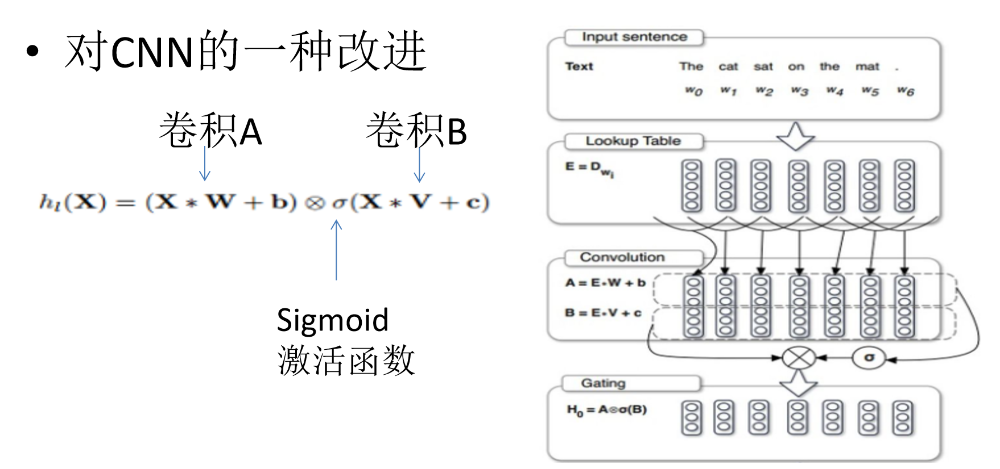

```
相当于是做了两次CNN，一次CNN当作门控制另一个CNN，但是CNN是可以做到完全并行的操作（每次卷积相互独立可以同时计算），运算效率高。RNN不行，它后一步需要依赖前一步的结果。

GateCNN比LSTm的效率更高
```


##### TextRCNN


##### BERT

Encoder和Decoder

模型角度上看都是先经过embedding再经过12层的transformers，只是训练目标不同导致的用法不同。用于输出结果的称作Decoder（前N个字预测下一个字，GPT），而根据前后预测中间的训练方式称之为编码器（BERT）。

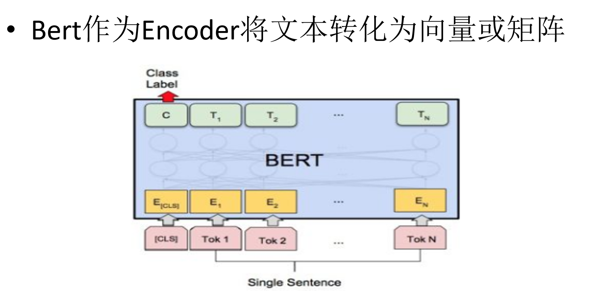

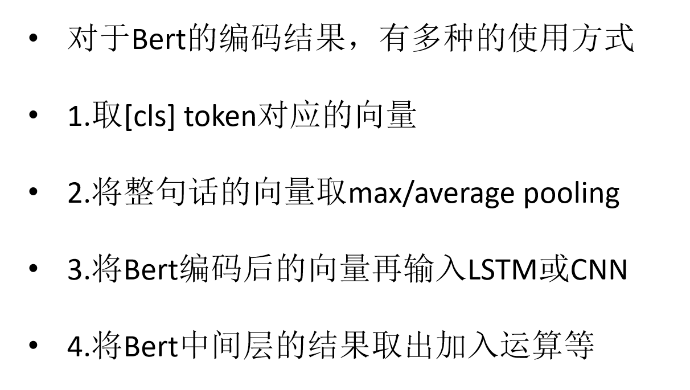

> 接LSTM或者CNN时一般不要接的太多，1到3层，太多随机初始化的结果会削弱预训练的效果
>
> 不推荐BERT+LSTM，BERT是预训练后的权重，但LSTM是随机初始化的，拼接在一起时学习率太小LSTM训练不到，太大就破坏BERT的预训练权重。
>
> 取CLS作为句向量是考虑到CLS在模型预训练阶段有针对CLS进行训练，或者考虑取全部结果求平均。


```
神经网络模型的理解：

Y= W * x + b  ，Y的结果取决于W和x，x是输入不会发生变化，W就决定Y的输出结果。模型的目的是寻找到合适的W使得输入x能够输出与真实的Y值接近的结果。

越大的模型预训练的效果越好，相应的学习率也应该调低，一般在1e-5左右比较合适。
```


###### 数据稀疏问题

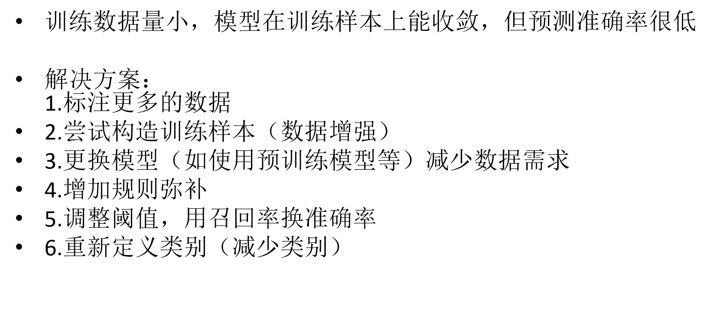

```
1.标注更多的数据主要的途径
2.大语言模型的数据增强效果很好
3.换语言模型
4.需要考虑规则带来的提升，能够直接使用规则判断就不要靠模型的结果
5.用召回率换准确率，比如设置阈值，预测结果低于0.5的结果直接舍弃，输出无法判断，只有大于0.5的概率才进行判断，这样会出现大量的无法判断的样本，召回率就会降低
```


###### 标签不均衡问题

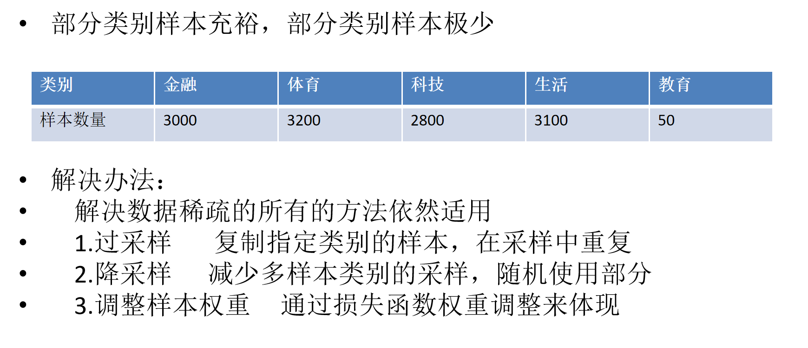

```
是否采用过采样和降采样需要考虑到数据集样本的实际情况，
当多标签的数据有冗余时，可以采用降采样，但是如果降低样本导致覆盖率低就不能使用
```


检查标注数据是否合理：

用简单模型进行训练，检查结果是否符合预期；

采用集内训练的方式，用训练集当作测试集，观察模型是否能够收敛，如果效果不好可能是数据标签存在问题；

###### 多标签分类

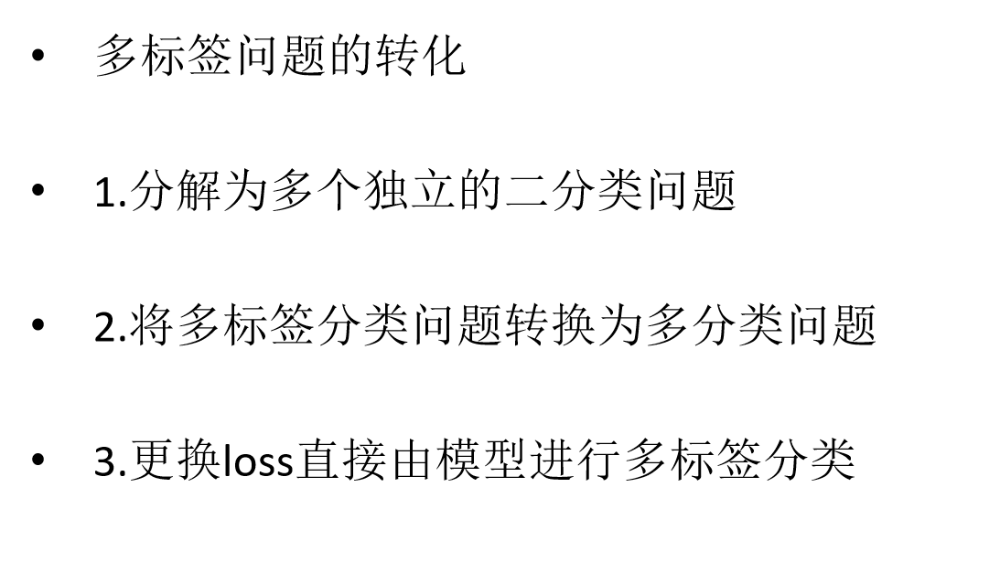

```
1.多次二分类
2.排列出所有可能的多分类标签列出来，直接转化为多分类任务
3.BECloss，专门用来进行多标签的loss,相当于是CE的变种，最后的预测的结果根据每个类别输出的概率进行预测，一般是大于0.5的为1，小于0.5为0
```

```
这里的作业有个电商评论的数据集
```


