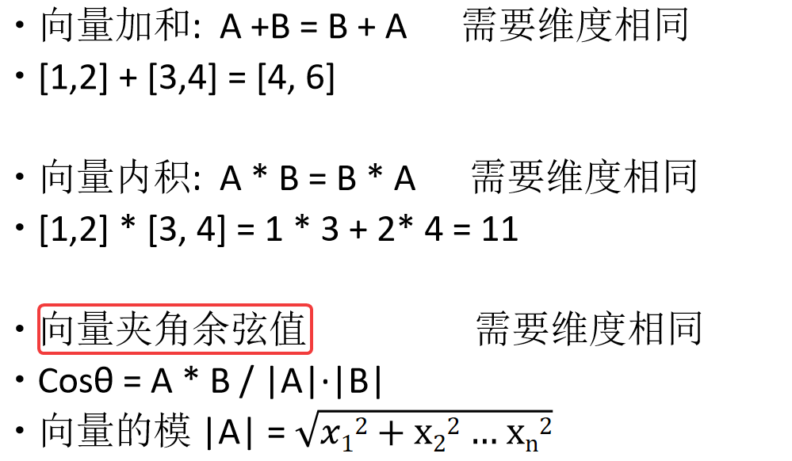
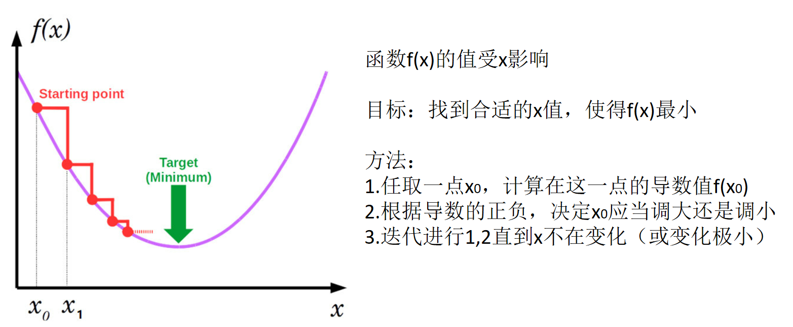
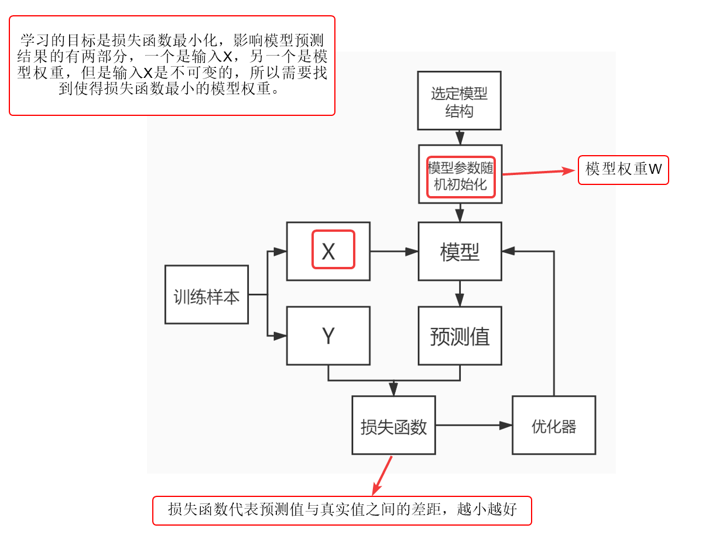
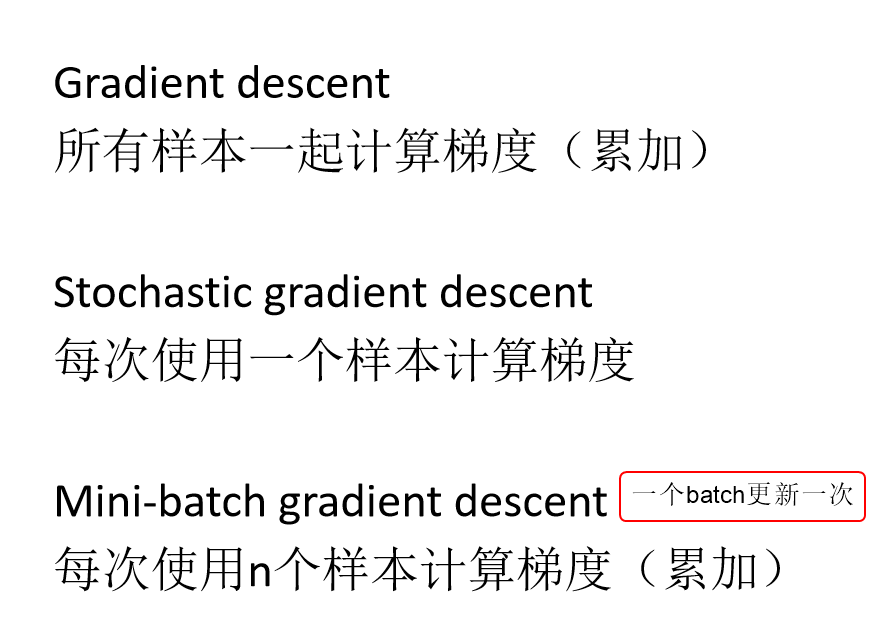
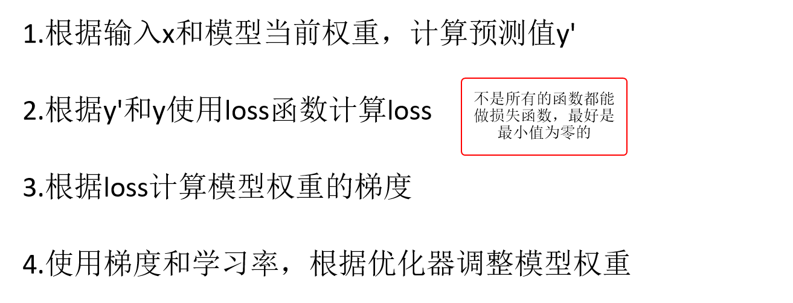
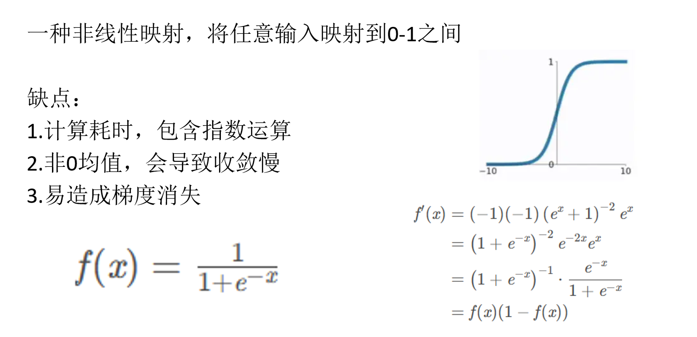
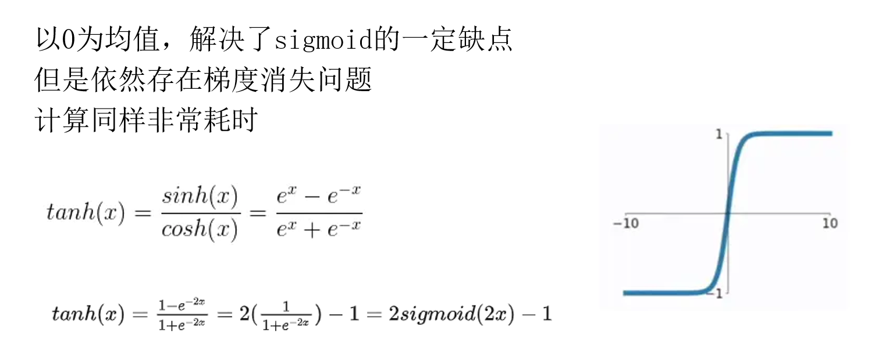
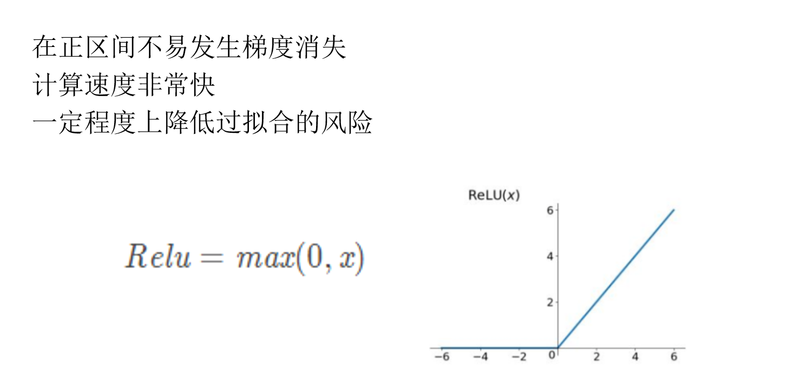
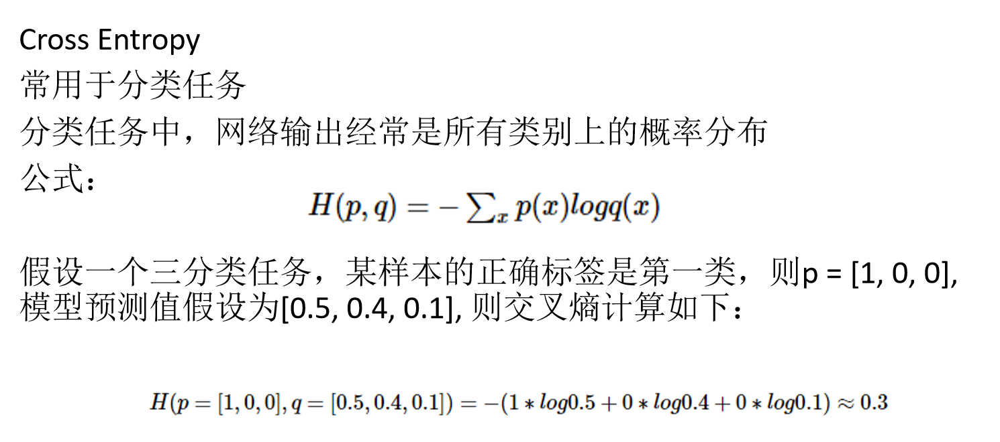
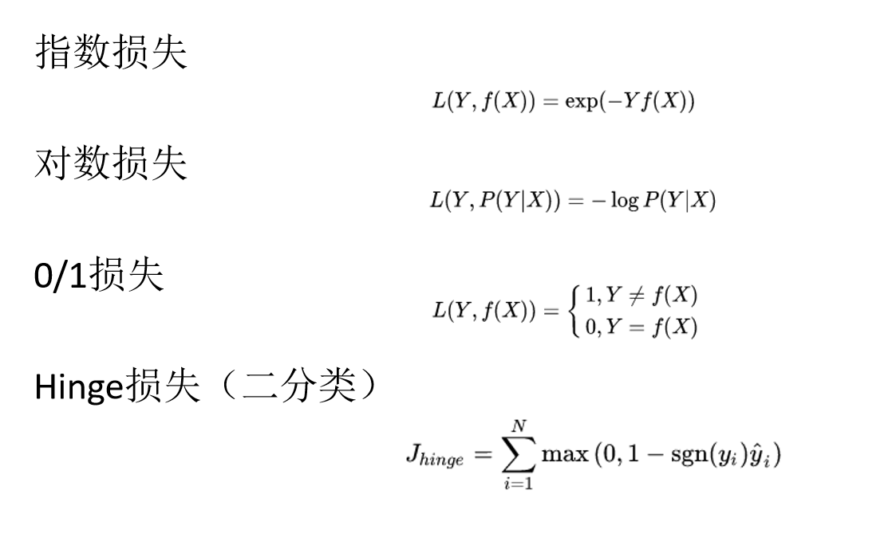

# 02 深度学习的组成部分

## 标量和向量

标量  Scalar  一个标量就是一个单独的数

向量  Vector  一个向量是一列数

可以把向量看做空间中的点，每个元素是不同坐标轴上的坐标，向量中有几个数，就叫几维向量如4维向量：[1,2,3,4]

## 矩阵

## 张量

张量多个矩阵的组合

## numpy常用操作

## 导数

## 梯度下降算法

### 找极小值问题

往梯度减小的方向找 ，梯度是函数在某一点的变化率或者斜率的向量，它指向函数增长最快的方向，如果我们想要找到函数的最小值，就需要朝着梯度的反方向寻找，既函数值下降最快的方向。

### 梯度

梯度时多元函数的导数，意义与导数基本一致。

深度学习是黑盒的原因：通过数据训练，得到大量的参数，但是无法解释参数为什么是这个值。

梯度下降方法是用来找极小值的，它只能指明函数值下降的方向，但是无法保证一定能够找到。

同时，在指明函数值下降的方向后还需要明确，要沿着该方向走多远。梯度下降法给出了具体走多远的公式：

## 深度学习

深度学习：使用梯度下降法优化模型参数

学习的内容：模型参数W，

学习的目标：损失函数极小值（损失函数越小代表预测和真实越接近）

学习的过程：对模型权重求导

流程：

1.选定模型结构：选择一个公式

2.模型参数初始化：给未知数随机赋值

3.把X输入模型得到预测值

4.预测值和真实值计算损失

5.梯度计算

6.根据梯度修改权重（优化器），原参数-梯度*学习率 = 现参数

### 权重更新方式

> （有什么区别？）
>
> 一般使用反向传播的随机梯度下降方法来最小化输出值的交叉熵，它也被称之为softmax函数输出的损失函数。反向传播首先计算最对最后的隐藏层到输出层的权重梯度，接着利用反向的链式法制，不断计算前一层针对权重的梯度，来调整不同网络层神经元之间的权重。整个神经网络训练是一个不断细化调整的过程，直到满足特定的停止条件。
>
> SGD每次迭代都使用一个训练样本来更新神经网络参数，参数估计会出现高方差，导致损失函数的值出现较大的波动，但相比每次迭代使用所有训练样本的批量梯度下降法BGD，SGD更容易发现好的局部参数最优值。在拥有大量训练样本的深度学习任务中，为了提高模型的训练速度，一般结合SGD和BGD的优点，使用小批量梯度下降Mini-Batch Gradient Descent，即每次迭代使用多个训练样本进行计算
>
> 不同的权重更新方式在优化算法中可以影响模型的训练速度、稳定性和性能。以下是一些常见的权重更新方式或优化算法：
>
> 1. **梯度下降法（Gradient Descent）**:
>    - **批量梯度下降（Batch Gradient Descent）**: 使用整个训练数据集计算梯度并更新权重。
>    - **随机梯度下降（Stochastic Gradient Descent，SGD）**: 在每个训练样本上计算梯度并更新权重，更新更频繁但更不稳定。
>    - **小批量梯度下降（Mini-Batch Gradient Descent）**: 每次使用一小批量样本（而不是整个数据集）来计算梯度并更新权重。
> 2. **动量优化（Momentum）**:
>    - 通过引入动量项来加速梯度下降，有助于处理梯度震荡问题。
> 3. **Adagrad（Adaptive Gradient Algorithm）**:
>    - 自适应地调整每个参数的学习率，根据参数的历史梯度调整学习率，对稀疏数据效果好。
> 4. **RMSProp（Root Mean Square Propagation）**:
>    - 对Adagrad进行改进，通过考虑梯度的平方的移动平均值来调整学习率。
> 5. **Adam（Adaptive Moment Estimation）**:
>    - 结合了Momentum和RMSProp的优点，通过计算梯度的一阶矩估计和二阶矩估计来调整学习率。
> 6. **Nesterov Accelerated Gradient (NAG)**:
>    - 是Momentum的一种变体，对动量方法进行修正以更准确地估计梯度。
> 7. **Adadelta**:
>    - 是对RMSProp的扩展，消除了学习率的需求，对参数的更新更稳定。
> 8. **L-BFGS（Limited-memory Broyden-Fletcher-Goldfarb-Shanno）**:
>    - 是一种基于拟牛顿法的优化算法，通常用于小批量数据集。
> 9. **Nadam**:
>    - 结合了Nesterov Accelerated Gradient和Adam的特性。

### 反向传播过程

>3.这里的loss是什么，是loss函数，还是loss的值？
>
>在机器学习和深度学习中，通常提到"loss"指的是损失函数（loss function），而不是损失的值。损失函数是用来衡量模型预测值与真实值之间的差异或错误程度的函数。而2中的loss是数值，损失函数（也称为loss function）是一个用于度量模型预测值与真实值之间差异的函数，它产生一个实数值，表示模型的预测误差程度。
>
>4.优化器什么作用

## 网络结构

### 全连接层

w的维度决定隐藏层的输出维度：w [2*3]  *  x [3*1] = 2 * 1

多个linear堆叠成为DNN（Deep Neural Network）

## 激活函数

将线性函数变为非线性

线性函数是导数为常数的函数，或者是能找到一条 y = k * x + b的直线拟合

Sigmoid

>应用领域：
>
>Sigmoid函数在机器学习和神经网络中经常用于二元分类问题，其中它可以将模型的输出映射到表示类别概率的范围。例如，在逻辑回归模型中，Sigmoid函数被用来估计样本属于某一类别的概率。

> 
> Sigmoid函数在神经网络中可能引发收敛困难的问题主要是因为它的均值不为零（非中心化），这会影响梯度下降法的效率。以下是一些相关问题：
>
> 1. **梯度消失问题**：Sigmoid函数的输出范围在0到1之间，当输入非常大或非常小时，其导数接近于零。这意味着在反向传播中，梯度会非常小，导致梯度下降的步长非常小，或者甚至无法更新网络参数。这被称为梯度消失问题，特别是在深度神经网络中更为明显。
> 2. **非中心化分布**：Sigmoid函数的输出均值约等于0.5，而不是零。当输入的数据分布具有零均值时，网络的学习更为高效。因为在非中心化分布下，梯度下降可能会在正方向和负方向上产生不平衡，导致梯度偏向某一方向，使训练不稳定。
> 3. **慢收敛**：由于Sigmoid函数的特性，神经网络的权重调整可能非常缓慢，特别是在深层网络中。这导致了训练时间的增加，因为需要更多的迭代来实现收敛。
>
> 为了克服Sigmoid函数带来的这些问题，研究人员引入了其他激活函数，如ReLU（Rectified Linear Unit）和其变种。ReLU具有以下优点：
>
> - ReLU函数在正数区域具有梯度为1，避免了梯度消失问题。
> - 它是非线性的，允许神经网络学习复杂的特征。
> - ReLU在大多数区域都是零均值的，因此有助于更快的收敛。
>
> 虽然ReLU引入了自己的问题（如神经元死亡问题），但它通常在深度神经网络中表现得更好，使训练更加高效。不过，在实际应用中，选择激活函数要根据具体问题和网络结构来决定，因为不同的激活函数适用于不同的情况。

Tanh

Relu

Softmax

> Softmax函数是一种常用的数学函数，通常用于多分类问题中的概率分布。它将一组实数转换为表示概率分布的值，使得这组值之和为1，并且每个值表示对应类别的概率。
>
> 对于给定的实数向量 $Z=(z_1,z_2,...,z_k)$，Softmax函数将该向量中的每个元素$z_i$转换为一个概率 $p_i$，即
> $$
> p_{i}=\frac{e^{z_{i}}}{\sum_{j=1}^{k} e^{z_{j}}}
> $$
> Softmax函数的特性保证了转换后的概率$p_i$ 为非负数且总和为1，这正符合概率分布的定义。Softmax函数的输入可以是任意实数值，但输出概率值范围在 0到 1 之间。
>
> 在机器学习中，Softmax函数常用于多分类问题的输出层，特别是在神经网络中。它将神经网络最后一层的原始输出转换为各个类别的概率，以便进行多分类任务的预测和训练。

## 损失函数

均方差：找极小值

交叉熵损失：分类任务

其他损失

