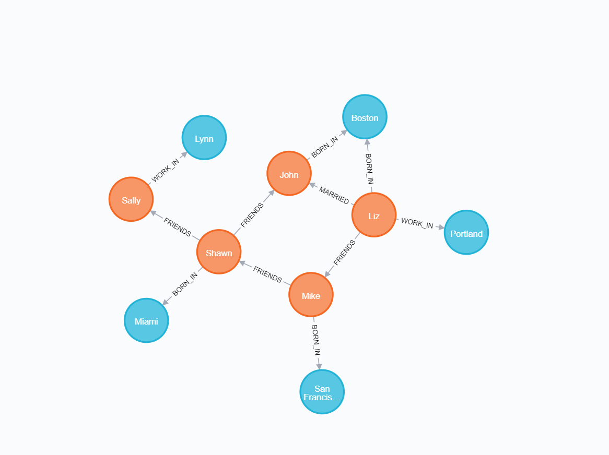

## 知识图谱

1. Neo4j简介

   Neo4j是一个开源的图形数据库管理系统。它是一种NoSQL数据库,与传统的关系型数据库不同,它使用图结构来存储数据。

   具体来说,Neo4j使用节点(node)和关系(relationship)来存储和管理数据。节点代表实体,比如人、地点、事物等,而关系则代表节点之间的联系,比如"朋友"、"工作于"、"位于"等。

   这种图形数据模型非常适合处理复杂的关系型数据,可以更好地反映现实世界中实体之间的联系。相比于传统的关系型数据库,Neo4j可以更快速、更直观地查询和分析这些关系数据。

   此外,Neo4j还提供了强大的查询语言Cypher,使用声明式语法可以轻松地对图数据进行复杂的查询和分析。它还支持水平扩展,可以在集群环境中运行,提高了系统的可靠性和性能。

2. 安装Neo4j并配置环境

   https://blog.csdn.net/qq_49172635/

3. 创建关系图

   - 删除数据库以往的图，创建空白环境

     ```
     MATCH (n) DETACH DELETE n
     ```

     这里，`MATCH`是**匹配**操作，而小括号()代表一个**节点**node（可理解为括号类似一个圆形），括号里面的n为**标识符**。

   - 创建人物节点

     ```
     CREATE (n:Person {name:'John'}) RETURN n
     CREATE (n:Person {name:'Sally'}) RETURN n
     CREATE (n:Person {name:'Steve'}) RETURN n
     CREATE (n:Person {name:'Mike'}) RETURN n
     CREATE (n:Person {name:'Liz'}) RETURN n
     CREATE (n:Person {name:'Shawn'}) RETURN n
     ```

     `CREATE`是**创建**操作，`Person`是**标签**，代表节点的类型。花括号{}代表节点的**属性**，属性类似Python的字典。这条语句的含义就是创建一个标签为Person的节点，该节点具有一个name属性，属性值是John。

   - 创建地区节点

     ```
     CREATE (n:Location {city:'Miami', state:'FL'})
     CREATE (n:Location {city:'Boston', state:'MA'})
     CREATE (n:Location {city:'Lynn', state:'MA'})
     CREATE (n:Location {city:'Portland', state:'ME'})
     CREATE (n:Location {city:'San Francisco', state:'CA'})
     ```

     可以看到，节点类型为Location，属性包括city和state。

   - 创建关系

     ```
     MATCH (a:Person {name:'Liz'}), 
           (b:Person {name:'Mike'}) 
     MERGE (a)-[:FRIENDS]->(b)
     
     MATCH (a:Person {name:'Shawn'}), 
           (b:Person {name:'Sally'}) 
     MERGE (a)-[:FRIENDS {since:2001}]->(b)
     
     MATCH (a:Person {name:'Shawn'}), (b:Person {name:'John'}) MERGE (a)-[:FRIENDS {since:2012}]->(b)
     MATCH (a:Person {name:'Mike'}), (b:Person {name:'Shawn'}) MERGE (a)-[:FRIENDS {since:2006}]->(b)
     MATCH (a:Person {name:'Sally'}), (b:Person {name:'Steve'}) MERGE (a)-[:FRIENDS {since:2006}]->(b)
     MATCH (a:Person {name:'Liz'}), (b:Person {name:'John'}) MERGE (a)-[:MARRIED {since:1998}]->(b)
     MATCH (a:Person {name:'John'}), (b:Location {city:'Boston'}) MERGE (a)-[:BORN_IN {year:1978}]->(b)
     MATCH (a:Person {name:'Liz'}), (b:Location {city:'Boston'}) MERGE (a)-[:BORN_IN {year:1981}]->(b)
     MATCH (a:Person {name:'Mike'}), (b:Location {city:'San Francisco'}) MERGE (a)-[:BORN_IN {year:1960}]->(b)
     MATCH (a:Person {name:'Shawn'}), (b:Location {city:'Miami'}) MERGE (a)-[:BORN_IN {year:1960}]->(b)
     MATCH (a:Person {name:'Steve'}), (b:Location {city:'Lynn'}) MERGE (a)-[:BORN_IN {year:1970}]->(b)
     MATCH (a:Person {name:'Sally'}), (b:Location {city:'Lynn'}) MERGE (a)-[:WORK_IN {year:2000}]->(b)
     ```

   - 参考文档https://zhuanlan.zhihu.com/p/88745411

4. 展示

   

