# 手搓代码

- [x] 1.multi-head attn.

dataloader

# 自我介绍

# Normalization

1. 归一化（normalization），又称正则化、规范化，被认为是能够提升算法性能的必备操作，能够将数据拽到相同的分布水平，CV中常用的是批归一化（batchNoramlization）,NLP主要使用层归一化（layerNormalization）

2. BN：将不同样本的相同维度的特征处理为相同分布。假设我们有 10行 3列 的数据，即我们的batchsize = 10，每一行数据有三个特征，假设这三个特征是【身高、体重、年龄】。那么BN是针对每一列（特征）进行缩放，例如算出【身高】的均值与方差，再对身高这一列的10个数据进行缩放。体重和年龄同理。这是一种“列缩放”。

   BN以跨样本的方式展开归一化，因此不会破坏不同样本同一特征之间的关系，毕竟“减均值，除标准差”是平移加缩放的线性操作。在“身高体重”的例子中，这就意味着“归一化前是高个儿的归一化后仍然是高个儿，归一化前胖的归一化后也不会变瘦”。这一性质进而决定了经过归一化操作后，样本之间仍然具有可比较性。但是，**特征与特征之间的不再具有可比较性**。（为什么？在身高体重的例子中，同一个样本之间的特征本来就不具有可比性。这里应该是想说在特征之间能够直接通过数值进行比较的样本中，特征之间不可比较，如词嵌入）

3. **BN为什么不适用在NLP中？**

   上面的问题已经是在说明这个问题了，BN之后**特征与特征之间的不再具有可比较性**。

   - 首先，无法直接计算。因为句子的长短不一，某些位置为空，无法执行归一化操作。
   - 其次，无意义。在身高体重的例子中归一化的数据分别是所有的身高和所有的体重，二者具有明确且相同的物理意义。但是对于文本来说不是这样的，每个句子中的相同位置的词汇不具有相同的性质。语言文本的复杂性是很高的，任何一个词都有可能放在初始位置，且词序可能并不影响我们对句子的理解。而BN是针对每个位置进行缩放，这不符合NLP的规律。

4. **LN为什么适合在NLP中？**

   就像在transformer的自注意力计算过程中，将每个字与同一句中其他字进行注意力的计算。我们需要保留句子中词与词之间的可比较性，因此需要对整个句子进行归一化操作。LN的操作类似于在句子中找到一个语义中心，将其他单词聚集在这个中心周围，句中词与词之间的可比较性不会遭到破坏。

5. **手动实现**

   ```python
   input_size = 10
   batch_size = 2
   max_len = 10
   
   epsilon = 1e-5
   a1 = torch.randn(input_size)
   b1 = torch.randn(input_size)
   def batch_norm(input_tensor):
       mean = torch.mean(input_tensor,dim=0,keepdim=True)
       variance = torch.var(input_tensor,dim=0,keepdim=True)
       
       normalized_input = a1 * (input_tensor-mean)/torch.sqrt(variance+epsilon) + b1
       return normalized_input
   
   def layer_norm(input_tensor):
       mean = torch.mean(input_tensor,dim=-1,keepdim=True)
       variance = torch.var(input_tensor,dim=-1,keepdim=True)
       
       normalized_input = a1 * (input_tensor-mean)/torch.sqrt(variance+epsilon) + b1
       return normalized_input
   
   
   input_tensor = torch.randn(batch_size, max_len, input_size)
   batch_norm_out = batch_norm(input_tensor)
   layer_norm_out = layer_norm(input_tensor)
   
   batch_norm_torch = nn.BatchNorm1d(max_len)
   layer_norm_torch = nn.LayerNorm(input_size)
   print(batch_norm_torch(input_tensor))
   print(batch_norm_out)
   print("----------------------")
   print(layer_norm_torch(input_tensor))
   print(layer_norm_out)
   ```

   

   

# 常见损失函数

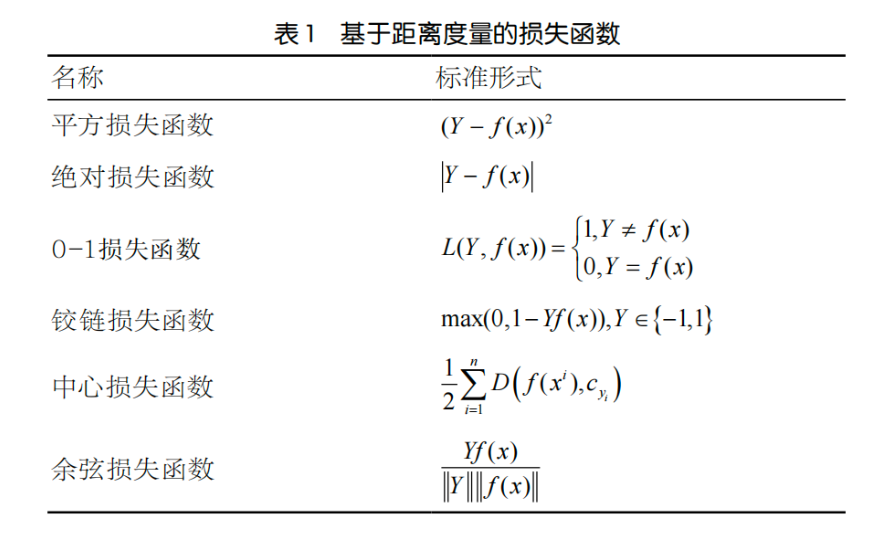

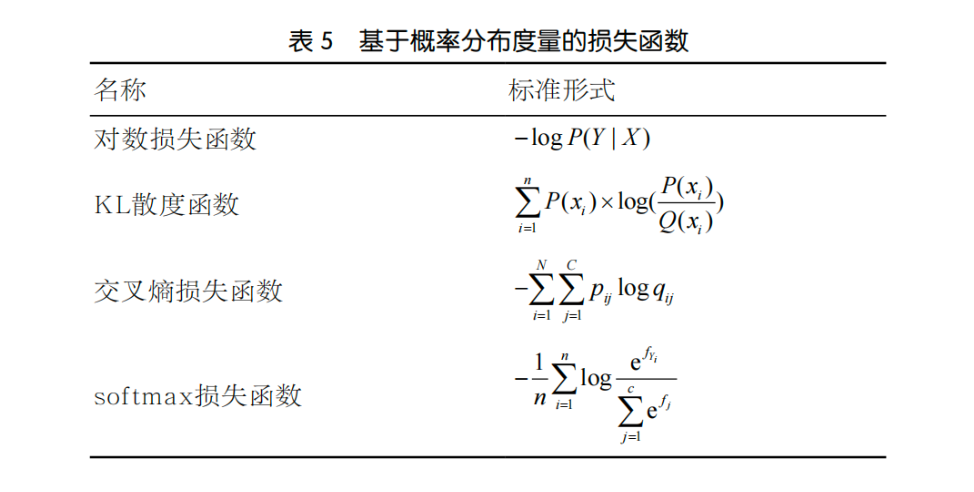

## 基于距离度量的损失函数

1. **均方误差（Mean Squared Error， MSE）**

   又称L2损失函数，用于**回归问题**，计算预测值和真实值之间差的平方的平均值。均方误差是通过计算**预测值与真实值之间差异的平方和的平均值**来衡量模型的性能。它对于较大的差异给予更高的权重，因为平方操作会放大较大的差异。均方误差的数值越小，表示模型预测的结果与真实值越接近。
   $$
   M S E=\frac{1}{n} \sum_{i=1}^{n}\left(y_{i}-\hat{y}_{i}\right)^{2}
   $$

   ```
   mse = np.mean((y_true - y_pred) ** 2
   ```

2. **平均绝对误差(Mean Absolute Error，MAE)**

   （L1损失函数）**曼哈顿距离**或**绝对值损失函数**，表示残差的绝对值之和。L1损失函数对离群点有很好的鲁棒性，但它在残差为零处却不可导。另一个缺点是更新的梯度始终相同，也就是说，即使很小的损失值，梯度也很大，这样不利于模型的收敛。针对它的收敛问题，一般的解决办法是在优化算法中使用变化的学习率，在损失接近最小值时降低学习率。	

   MAE 的值越小，表示模型的预测越准确。MAE 的原理非常简单，它是所有绝对误差的平均值。绝对误差是指每个观测值的**预测值与实际值之间的差的绝对值**
   $$
   M A E=\frac{1}{n} \sum_{i=1}^{n}\left|y_{i}-\hat{y}_{i}\right|
   $$

   ```
   MSE计算简便，但MAE对异常点有更好的鲁棒性: 当数据中存在异常点时，用MSE/RMSE计算损失的模型会以牺牲了其他样本的误差为代价，朝着减小异常点误差的方向更新。然而这就会降低模型的整体性能。 直观上可以这样理解：如果我们最小化MSE来对所有的样本点只给出一个预测值，那么这个值一定是所有目标值的平均值。但如果是最小化MAE，那么这个值，则会是所有样本点目标值的中位数。众所周知，对异常值而言，中位数比均值更加鲁棒，因此MAE对于异常值也比MSE更稳定。
   NN中MAE更新梯度始终相同，而MSE则不同： MSE损失的梯度随损失增大而增大，而损失趋于0时则会减小。
   Loss选择建议：
   MSE： 如果异常点代表在商业中很重要的异常情况，并且需要被检测出来
   MAE： 如果只把异常值当作受损数据
   ```

3. **均方根误差**

   均方根误差（RMSE），是均方误差（MSE）的平方根。它是均方误差的一种变体，其计算方法为将MSE的结果开根号。
   $$
   L(Y \mid f(x))=\sqrt{\frac{1}{n} \sum_{i=1}^{N}\left(Y_{i}-f\left(x_{i}\right)\right)^{2}}
   $$
   

4. **余弦相似度损失**

   余弦相似度损失是一种常用的机器学习损失函数，用于衡量向量之间的相似性。它基于向量的内积和范数来计算相似度，并将其转化为一个损失值。

   余弦相似度损失基于余弦相似度的概念。余弦相似度是两个向量之间的夹角的余弦值，范围在-1到1之间。当夹角为0度时，余弦相似度为1，表示两个向量完全相同；当夹角为90度时，余弦相似度为0，表示两个向量无关；当夹角为180度时，余弦相似度为-1，表示两个向量完全相反。

   公式表达：假设有两个向量A和B，余弦相似度可以通过以下公式计算：
   $$
   \operatorname{similarity}(A, B)=\frac{A \cdot B}{\|A\|\|B\|}
   $$

5. **huber损失函数**

   huber损失是平方损失和绝对损失的综合，它克服了平方损失和绝对损失的缺点，不仅使损失函数具有连续的导数，而且利用MSE梯度随误差减小的特性，可取得更精确的最小值。尽管huber损失对异常点具有更好的鲁棒性，但是，它不仅引入了额外的参数，而且选择合适的参数比较困难，这也增加了训练和调试的工作量。
   $$
   L(Y \mid f(x))=\left\{\begin{array}{ll}\frac{1}{2}(Y-f(x))^{2} & |\mathrm{Y}-\mathrm{f}(\mathrm{x})|<=\delta \\ \delta|Y-f(x)|-\frac{1}{2} \delta^{2} & |\mathrm{Y}-\mathrm{f}(\mathrm{x})|>\delta\end{array}\right.
   $$
   

6. **0-1损失函数**
   $$
   L(Y, f(x))=\left\{\begin{array}{l}1, Y \neq f(x) \\ 0, Y=f(x)\end{array}\right.
   $$
   0-1损失函数相等这个条件太过严格，可以放宽条件，$|Y-f(x)|<t$时认为相等:
   $$
   L(Y, f(x))=\left\{\begin{array}{l}1,|Y-f(x)|>t \\ 0,|Y-f(x)| \leqslant t\end{array}\right.
   $$

7. **铰链/折页损失函数**

   铰链损失（hinge loss）也被称为合页损失或折页损失，它最初用于求解最大间隔的二分类问题。铰链损失函数是一个分段连续函数，当Y和f(x)的符号相同时，预测结果正确；当Y和f(x)的符号相反时，铰链损失随着f(x)的增大线性增大。铰链损失函数最著名的应用是作为支持向量机（support vector machine，SVM）的目标函数，其性质决定了SVM具有稀疏性，也就是说，分类正确但概率不足 1 和分类错误的样本被识别为支持向量，用于划分决策边界，其余分类完全正确的样本没有参与模型求解。
   $$
   \max (0,1-Y f(x)), Y \in\{-1,1\}
   $$
   

## 基于概率分布的损失函数

1. **KL散度函数（相对熵）**
   $$
   L(Y \mid f(x))=\sum_{i=1}^{n} Y_{i} \times \log \left(\frac{Y_{i}}{f\left(x_{i}\right)}\right)
   $$
   公式中Y代表真实值，f(x)代表预测值。

   KL散度（ Kullback-Leibler divergence）也被称为相对熵，是一种非对称度量方法，常用于度量两个概率分布之间的距离。KL散度也可以衡量两个随机分布之间的距离，两个随机分布的相似度越高的，它们的KL散度越小，当两个随机分布的差别增大时，它们的KL散度也会增大，因此KL散度可以用于比较文本标签或图像的相似性。

   基于KL散度的演化损失函数有JS散度函数。JS散度也称JS距离，用于衡量两个概率分布之间的相似度，它是基于KL散度的一种变形，消除了KL散度非对称的问题，与KL散度相比，它使得相似度判别更加准确。

   相对熵是恒大于等于0的。当且仅当两分布相同时，相对熵等于0。

2. **交叉熵损失**

   在**分类问题**中，我们将实际标签表示为一个one-hot向量，即只有一个元素为1，其余元素为0；而模型的预测结果通常是一个概率分布。交叉熵损失通过计算实际标签和模型预测结果之间的交叉熵来评估模型的性能。
   对于多分类问题，交叉熵损失可以表示为：
   $$
   Loss =-\sum_{i=1}^{N} y_{i} \log \left(p_{i}\right)
   $$
   其中$y_i$是标签值，$p_i$是对应的概率分布。

   ```python
   #假设有3个样本，每个都在做3分类
   pred = torch.FloatTensor([[0.3, 0.1, 0.3],
                             [0.9, 0.2, 0.9],
                             [0.5, 0.4, 0.2]])
   #正确的类别分别为1,2,0
   target = torch.LongTensor([1, 2, 0])
   
   ce_loss = nn.CrossEntropyLoss()
   loss = ce_loss(pred,target)
   print(loss)
   def softmax_n(matrix):
       return np.exp(matrix) / np.sum(np.exp(matrix), axis=1, keepdims=True)
   def to_one_hot(target, shape):
       one_hot_target = np.zeros(shape)
       for i,t in enumerate(target):
           one_hot_target[i][t] = 1
       return one_hot_target
   
   """
   交叉熵理解：
   交叉熵的本质是 对数损失，pytorh中的实现是，对于每一个样本来说，计算预测为真实
   标签的对数损失：-1*log(预测该值为真实标签的概率)
   以常见的01分类为例：
       当预测标签为0时，此时的损失为 -1*(log(预测为0的概率))
       当预测标签为1时，此时的损失为 -1*(log(预测为1的概率))
       组合起来就是-1*[真实标签 * log(预测为1的概率) + （1-真实标签） * log(1-预测为1的概率)]
   """
   def cross_entropy(pred,target):
       bs,class_nums = pred.shape
       pred = softmax_n(pred)
       target = to_one_hot(target,pred.shape)
       entropy = -np.sum(target*np.log(pred), axis=1)
       return sum(entropy)/bs
   ```

   

3. **对数损失**

   对数损失（Log Loss），也称为**二分类交叉熵损失**，是机器学习中常用的一种损失函数之一，主要适用于二分类问题。它用于衡量模型预测结果与实际标签之间的差异。

   ​		对数损失基于信息论中的交叉熵概念，用于度量两个概率分布之间的相似性。在二分类问题中，通常使用0和1表示实际标签，而模型的预测结果是一个介于0和1之间的概率值。对数损失通过计算实际标签和模型预测结果的交叉熵来评估模型的性能。

   对数损失可以表示为：
   $$
   \operatorname{Loss}=-(y \log (p)+(1-y) \log (1-p))
   $$
   

4. **softmax损失函数公式**
   $$
   L(Y \mid f(x))=-\frac{1}{n} \sum_{i=1}^{n} \log \frac{e^{f_{Y_{i}}}}{\sum_{j=1}^{c} e^{f_{j}}}
   $$
   从标准形式上看，softmax损失函数应归到对数损失的范畴，在监督学习中，由于它被广泛使用，所以单独形成一个类别。

   softmax损失函数本质上是逻辑回归模型在多分类任务上的一种延伸，常作为CNN模型的损失函数。softmax损失函数的本质是将一个k维的任意实数向量x映射成另一个k维的实数向量，其中，输出向量中的每个元素的取值范围都是(0,1)，即softmax损失函数输出每个类别的预测概率。由于softmax损失函数具有类间可分性，被广泛用于分类、分割、人脸识别、图像自动标注和人脸验证等问题中，其特点是类间距离的优化效果非常好，但类内距离的优化效果比较差。

   softmax损失函数具有类间可分性，在多分类和图像标注问题中，常用它解决特征分离问题。在基于卷积神经网络的分类问题中，一般使用softmax损失函数作为损失函数，但是softmax损失函数学习到的特征不具有足够的区分性，因此它常与对比损失或中心损失组合使用，以增强区分能力。

# 常见激活函数

1. **Sigmoid激活函数**

   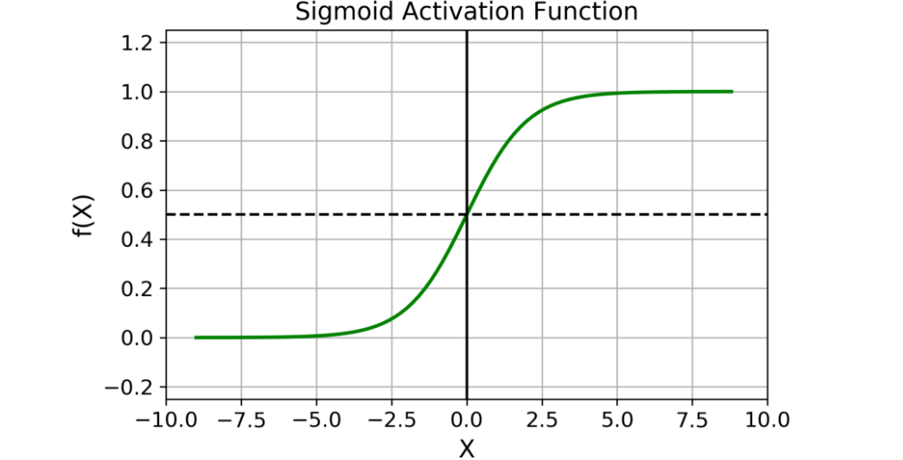

   Sigmoid 函数的图像看起来像一个 S 形曲线。
   $$
   f(z)=1 /\left(1+e^{\wedge}-z\right)
   $$
   适用范围：

   - Sigmoid 函数的输出范围是 0 到 1。由于输出值限定在 0 到 1，因此它对每个神经元的输出进行了归一化；
   - 用于将预测概率作为输出的模型。由于概率的取值范围是 0 到 1，因此 Sigmoid 函数非常合适；
   - 梯度平滑，避免「跳跃」的输出值；
   - 函数是可微的。这意味着可以找到任意两个点的 sigmoid 曲线的斜率；
   - 明确的预测，即非常接近 1 或 0。

   Sigmoid 激活函数有哪些缺点：

   - 倾向于梯度消失；
   - 函数输出不是以 0 为中心的，这会降低权重更新的效率；
   - Sigmoid 函数执行指数运算，计算机运行得较慢。

2. **Tanh / 双曲正切激活函数**

   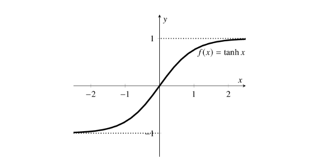

   tanh 激活函数的图像也是 S 形，表达式如下：
   $$
   f(x)=\tanh (x)=\frac{2}{1+e^{-2 x}}-1
   $$


   tanh 是一个双曲正切函数。tanh 函数和 sigmoid 函数的曲线相对相似。但是它比 sigmoid 函数更有一些优势。

   - 首先，当输入较大或较小时，输出几乎是平滑的并且梯度较小，这不利于权重更新。二者的区别在于输出间隔，tanh 的输出间隔为 1，并且整个函数以 0 为中心，比 sigmoid 函数更好；
   - 在 tanh 图中，负输入将被强映射为负，而零输入被映射为接近零。

   注意：在一般的二元分类问题中，tanh 函数用于隐藏层，而 sigmoid 函数用于输出层，但这并不是固定的，需要根据特定问题进行调整。

   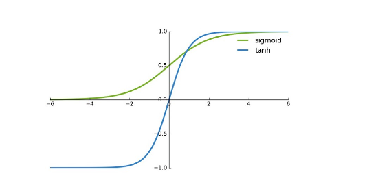

3. **ReLU 激活函数**

   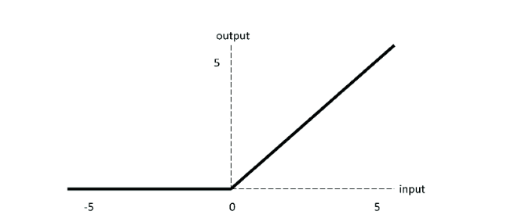

   ReLU 激活函数图像如上图所示，函数表达式如下：
   $$
   \sigma(x)=\left\{\begin{array}{cc}\max (0, x) & , x>=0 \\ 0 & , x<0\end{array}\right.
   $$
   ReLU 函数是深度学习中较为流行的一种激活函数，相比于 sigmoid 函数和 tanh 函数，它具有如下优点：

   - 当输入为正时，不存在梯度饱和问题。
   - 计算速度快得多。ReLU 函数中只存在线性关系，因此它的计算速度比 sigmoid 和 tanh 更快。

   当然，它也有缺点：

   1. Dead ReLU 问题。当输入为负时，ReLU 完全失效，在正向传播过程中，这不是问题。有些区域很敏感，有些则不敏感。但是在反向传播过程中，如果输入负数，则梯度将完全为零，sigmoid 函数和 tanh 函数也具有相同的问题；

   2. 我们发现 ReLU 函数的输出为 0 或正数，这意味着 ReLU 函数不是以 0 为中心的函数。

      ```
      Dead ReLU 指的是在深层神经网络中,由于不合理的参数初始化或梯度消失问题,导致某些ReLU神经元的输出永远为0的现象。
      也就是对输入值小于0的部分直接修剪为0,对大于0的部分保留不变。
      
      在神经网络中,如果ReLU的输入一直小于0,那么对应神经元的输出将永远为0。这些永远输出0的神经元就被称为"死掉"的ReLU神经元,因为它们不会对网络的输出产生任何影响。
      
      Dead ReLU的根本原因在于不理想的参数初始化方法。一种常见的情况是,如果ReLU的输入初始化值过大或过小,那么大部分神经元在训练开始时就已经"死亡"。因此,合理的参数初始化方法可以有效避免这个问题。
      ```

      

4. **Softmax**

   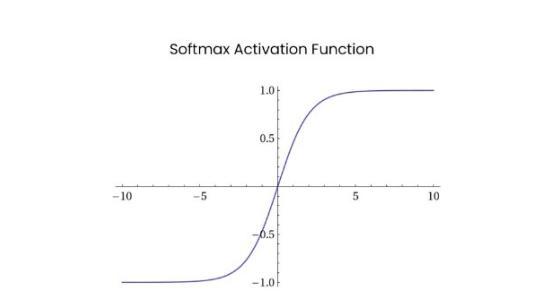

   Softmax 是用于多类分类问题的激活函数，在多类分类问题中，超过两个类标签则需要类成员关系。对于长度为 K 的任意实向量，Softmax 可以将其压缩为长度为 K，值在（0，1）范围内，并且向量中元素的总和为 1 的实向量。

   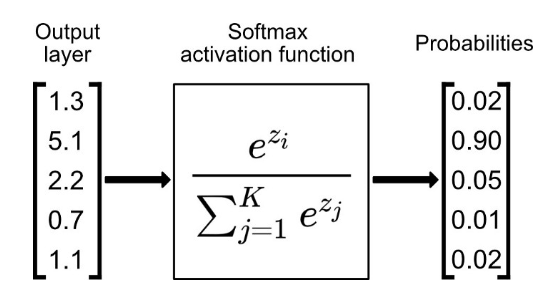

   Softmax 与正常的 max 函数不同：max 函数仅输出最大值，但 Softmax 确保较小的值具有较小的概率，并且不会直接丢弃。我们可以认为它是 argmax 函数的概率版本或「soft」版本。

   

   Softmax 函数的分母结合了原始输出值的所有因子，这意味着 Softmax 函数获得的各种概率彼此相关。

   

   Softmax 激活函数的主要缺点是：

   1. 在零点不可微；
   2. 负输入的梯度为零，这意味着对于该区域的激活，权重不会在反向传播期间更新，因此会产生永不激活的死亡神经元。

5. **GELU**

   与其他常用的激活函数（如ReLU和sigmoid）相比，GELU具有更平滑的非线性特征，这有助于提高模型的性能。GELU可以看作是一种sigmoid和ReLU的混合体，具有如下公式：
   $$
   \operatorname{GELU}(x)=0.5 x\left(1+\tanh \left(\sqrt{2 / \pi}\left(x+0.044715 x^{3}\right)\right)\right)
   $$
   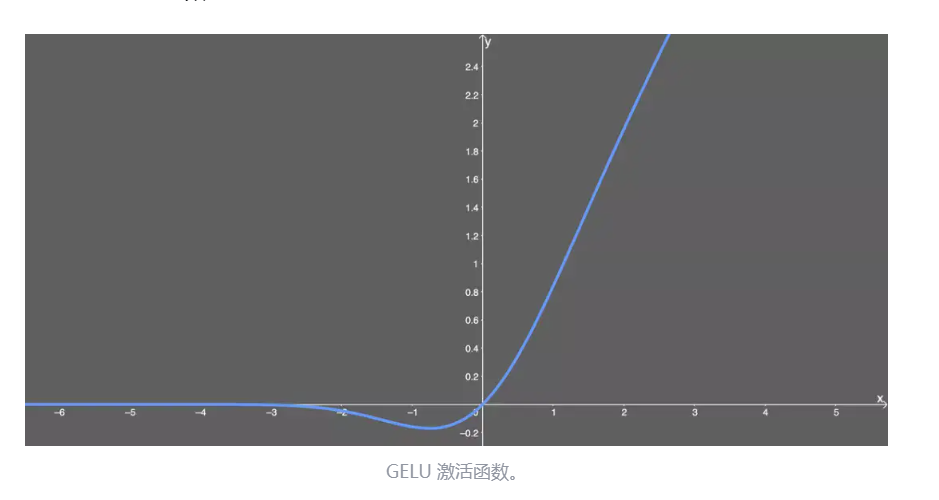

   优点：

   - 似乎是 NLP 领域的当前最佳；尤其在 Transformer 模型中表现最好；
   - 能避免梯度消失问题。

   缺点：

   - 尽管是 2016 年提出的，但在实际应用中还是一个相当新颖的激活函数。

6. **Swish**

   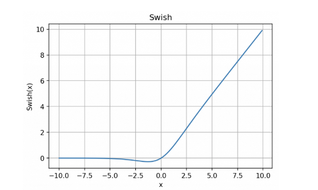

   函数表达式：y = x * sigmoid (x)

   Swish 的设计受到了 LSTM 和高速网络中 gating 的 sigmoid 函数使用的启发。我们使用相同的 gating 值来简化 gating 机制，这称为 self-gating。

   

   self-gating 的优点在于它只需要简单的标量输入，而普通的 gating 则需要多个标量输入。这使得诸如 Swish 之类的 self-gated 激活函数能够轻松替换以单个标量为输入的激活函数（例如 ReLU），而无需更改隐藏容量或参数数量。

   

   Swish 激活函数的主要优点如下：

   

   - 「无界性」有助于防止慢速训练期间，梯度逐渐接近 0 并导致饱和；（同时，有界性也是有优势的，因为有界激活函数可以具有很强的正则化，并且较大的负输入问题也能解决）；
   - 导数恒 > 0；
   - 平滑度在优化和泛化中起了重要作用。


# PLMs

## 常见预训练语言模型

1. 自回归语言模型

   单向

   GPT

2. 自编码语言模型

   双向

   BERT

3. 双向自回归

   - BART

     - BART模型的全称是bidirectional and auto-regressive transformers ,吸收了BERT的双向编码和GPT的从左到右解码的各自特点，建立再标准的seq2seq Transformer model的基础之上，比BERT更适合文本生成场景，比GPT多了双向上下文的语境信息。

     - BATR模型结构

       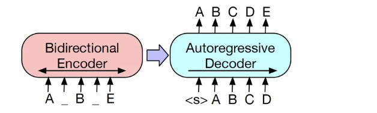

       BART模型的关键是在预训练的Encoder阶段使用多种噪声对原始文本进行破坏，然后再使用Decoder重建原始文本。编码器的最后一层隐藏层表示会作为记忆参与解码器的每一层计算。

     - BART考虑了多种引入噪声的方式，其中包括BERT使用的单词掩码。需要注意的是BERT模型是独立地预测掩码位置的词，而BART模型是通过自回归的方式顺序生成。BART模型考虑5中噪声的引入方式：

       - 单词掩码。推断单个token能力
       - 单词删除。推断单个token及其位置能力
       - 句子排列变换。推断前后句关系能力
       - 文档旋转变换。推断文档开头的能力
       - 文本填充。推断一段span对应多少token的能力

     - 

     

   

4. 

   

   


# LLM

## LLM与传统预训练模型的区别

1. 多头共享机制

   > 传统的多头机制
   >
   > transformer模型在self-attention中将输入特征切割成多份，假设经过embedding层后的特征是10*768，会被切分成12个head，每一部分是10 * 64 ，作为一个单独的文本表示，分别与qkv3个线性层相乘，计算self-attention，再合并回成原来的10 * 768 的完整文本表示

   但是传统方式的问题是计算量大，需要计算多个QKV，于是有以下的改进方法，减少K和V的参数，（Q代表输出，一般不缩减）（为什么Q代表输出？）

   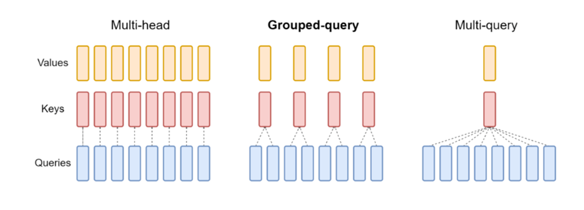

   - Grouped-query

     将Q分为N组，一组Q使用一个K和V

   - Multi-query

     所用Q只使用一个KV

2. Attention结构

   传统的Attention结构是线性的，需要先计算self-atten，再经过残差+归一化，之后经过前馈层，再做残差+归一化，GPTJ采用一种并行的方式，计算self-atten的同时计算，hidden经过前馈层的结果，之后对atten结果、前馈层结果、hidden结果进行残差+归一化（moss, palm用的这种结构，目前不算太主流）

   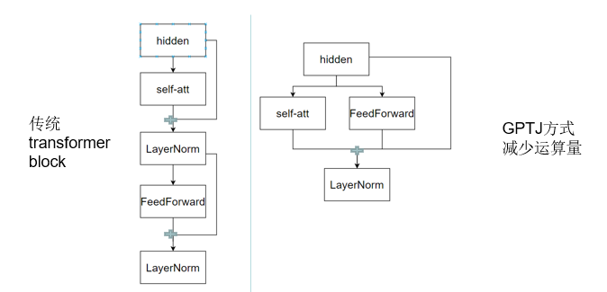

3. 归一化层

   传统预训练使用的是LN（layerNormalization），现在部分模型使用RMS Norm （Root Mean Square Layer Normalization，均方根标准化）

   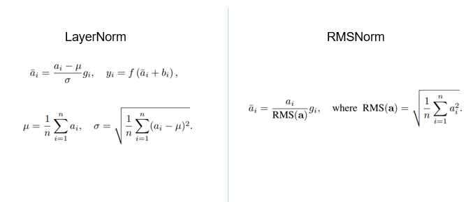

   - RMSNorm是对LN的一种改进（移除均值项），可以看作是LN在均值为零时的一个特例。与LN不同，它不是使用整个样本的均值和方差而是使用平方根的均值进行归一化，这样做可以降低噪声的影响。作者认为这种方法在简化LN的同时能够及降低7%-64%的计算时间（减少了均值和偏执的计算）。

4. 归一化层位置

   传统的归一化层是在残差后做归一化（post-LN），现在又提前归一化（Pre-LN），前后归一化（Sandwich-LN）的做法

   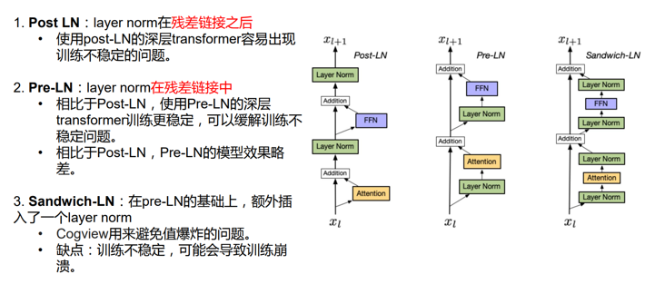

   - Deep Norm：是对post-LN的改进

     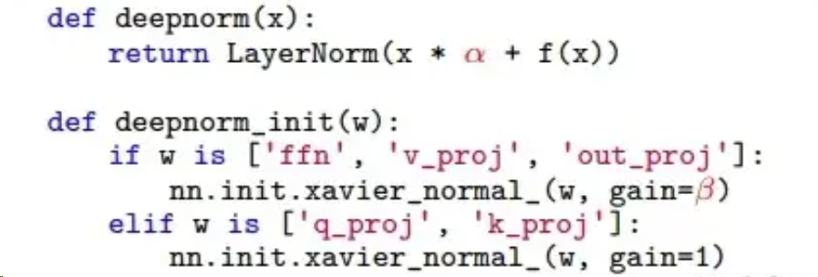

     - DeepNorm在进行Layer Norm之前会以a参数扩大残差连接
     - 在Xavier参数初始化过程中以b减小部分参数的初始化范围

     DeepNorm在具备Post-LN良好性能的同时又有Pre-LN的稳定

5. 激活函数

   原始机器翻译中的attention使用的是relu，BERT使用的是gelu，现在使用最多的是Swish

6. 相对位置编码

   - 位置编码的意义

     由于transformer中使用的都是线性层，编码过程中没有明显的位置信息，对于字词位置的交换，仅相当于矩阵中位置的交换，这带来并行计算的优势，但也弱化了语序信息（仅仅交换位置会导致后面池化时不同语序文本表示是相同的），因此需要引入位置编码来弥补

   - 文本长度外推性

     原始transformer的位置编码是固定的，BERT的位置编码是可学习的，但是学习到的编码仍然是固定的。虽然这种位置编码已经能够满足不同语序文本表示不同的需求，但是人们希望更进一步让模型满足文本外推性（预测时序列长度比训练时候长，模型依然有好的表现，称为有较好的长度外推性）

     长度外推性只是锦上添花，过长的文本还是需要预先的处理。但是原始的Bert来说，绝对位置编码不能处理超过512长度的文本，相对位置则没问题，至少可以输出结果

   - 目前主流的位置编码

     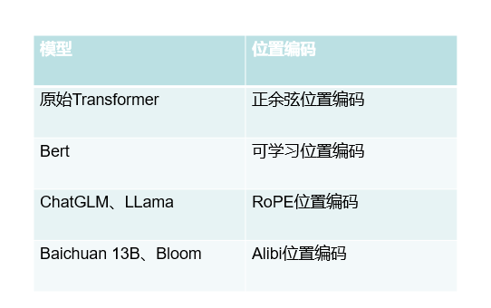

     - 正余弦位置编码

       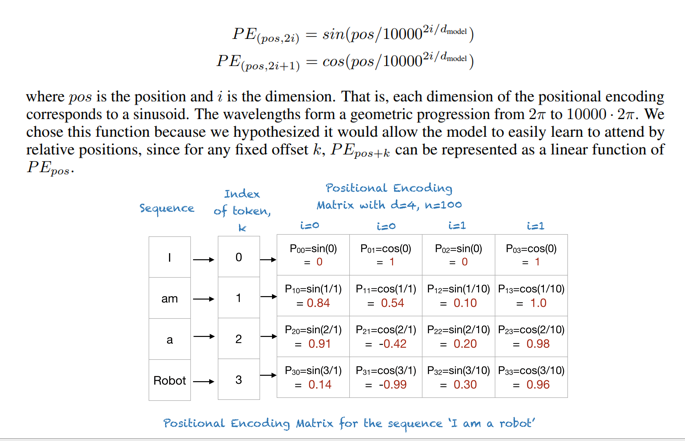

       利用公式直接计算出位置信息。理论上，使用固定公式计算的位置编码可以预测时输入比训练时更长的文本位置编码，但是更长位置编码在训练时没有接触过，预测时实用的效果不好

     - 可学习位置编码

       一般称为position embedding，以Bert为代表，如同token embedding一样，随机初始化之后，靠梯度反传学习调整，缺点在于无法外推，需要预设最大长度。这个预设的长度的上限在预训练时已经被设置了，当输入的文本长度超过512后，position embedding就无法分配位置编码。

       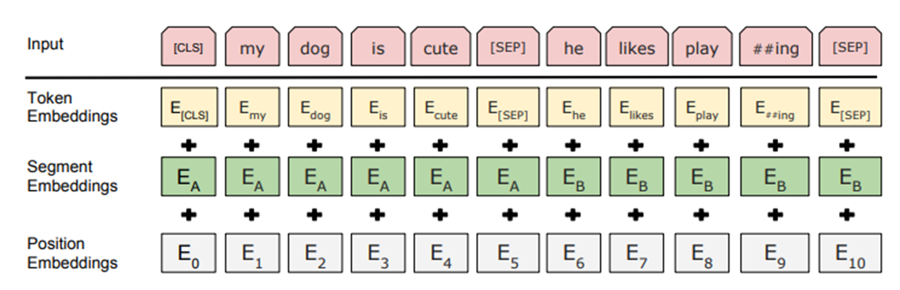

     - RoPE相对位置编码

       旋转式位置编码（Rotary Position Embedding）

       旋转式位置编码（RoPE）提出的一种能够将相对位置信息依赖集成到 self-attention 中并提升 transformer 架构性能的位置编码方式。 LLaMA 模型也是采用该位置编码方式。
   
       原理是在原始的token embedding中施加一个和三角函数有关的映射，对QKV分别施加这种变化，这样qk在做乘积时就会和原来的Qm和Qn以及m和n之间的差值有关。相当于在原始的编码上套了一层函数，实现了相对位置编码的效果。
       
       (详细推导https://www.zhihu.com/tardis/zm/art/647109286)
       
       最终实现的效果：在计算self-attention时既包含了一个token相对于另一个token的文本表示信息，也包含了两者的相对位置信息。这种做法就不再需要一个额外的position embedding，在预测时即使长度超过训练时的文本长度，但是文本之间的相对位置是学习过的，可以达到文本长度外推性。
       
       
       
       缺点：随着距离变长，位置编码的能力自动衰减，编码的差值在逐渐减小。如果两个字之间的距离太远，就会弱化transformer的长距离依赖的能力，出现了类似RNN的性质（原始的transformer计算第一个token和最后一个token之间的注意力分数，和计算第一个token和第二个token是没有区别的，这也是transformer优于LSTM的地方之一，另一个是可以并行计算）
       
       
       
       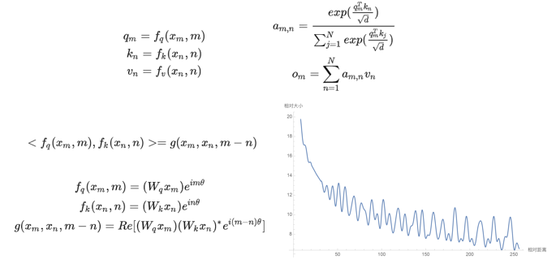
       
       - Alibi位置编码
       
         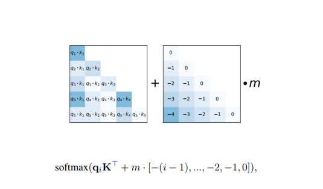
       
         在q * k 矩阵上加上一个相对位置矩阵，简单
       
         
       
     
   

## 常见LLM

1. ChatGLM

   ChatGLM的基座模型是GLM，GLM既可以做Encoder也可以做Decoder，主要通过两种方法实现：

   - [mask] : bert形式，随机mask文本中的短span
   - [gmask]：gpt形式，mask末尾的长span

   ChatGLM在做生成式任务式使用[gmask]，chatglm2中完全采用gmask进行训练

   词表的大小从ChatGLM的150528缩小为65024 （一个直观的体验是ChatGLM2、3加载比ChatGLM快不少）

   在ChatGLM的内部结构中的变换，从上到下依次是：

   - 位置编码：从BERT的训练式位置编码转变为旋转位置编码
   - 激活函数：从BERT的GeLU转变为GLU，在ChatGLM2中又变成了SwiGLU
   - LayerNormalization：在ChatGLM中采用的是DeepNorm，是对post-Normalization的改进，即在残差后做Normalization。在ChatGLM中把layer-normalization改为RMS-Normalization.

   在ChatGLM2.0中还添加了一些其他的变化：

   - FlashAttention：利用显存和内存来做加速
   - Multi-Query Attention：多头只采用一个KV对，通过参数共享降低显存占用

   省流：ChatGLM2与ChatGLM3模型架构是完全一致的，ChatGLM与后继者结构不同。可见ChatGLM3相对于ChatGLM2没有模型架构上的改进。

2. baichuan

   从上到下依次是：

   - 位置编码：7B采用的是旋转位置编码，13B采用的是ALIBI位置编码
   - 激活函数：SwiGLU
   - Normalization：RMS Norm，对每个layer的输入进行normalization，输入和attention残差之后进行normalization
   - 残差：输入和attention残差，attention和mlp输出残差
   - 其他优化：memory efficiency attention

3. LLaMA

   先从数据的角度，llama2.0为2T，llama1.0是1.4T

   其次是上下文长度，llama是2k，llama2是4K

   最后从模型架构角度：从整体上看，两者都遵循自回归的Transformer架构，只不过二者的内部细节有所不同：

   - 位置编码：都采用了旋转位置编码
   - Normalization：都采用了pre-normalization，之不过1中采用的是原始的layerNormalization，2采用的是RMSNorm
   - 激活函数：采用SwiGLU

   LLaMA2结构
   
   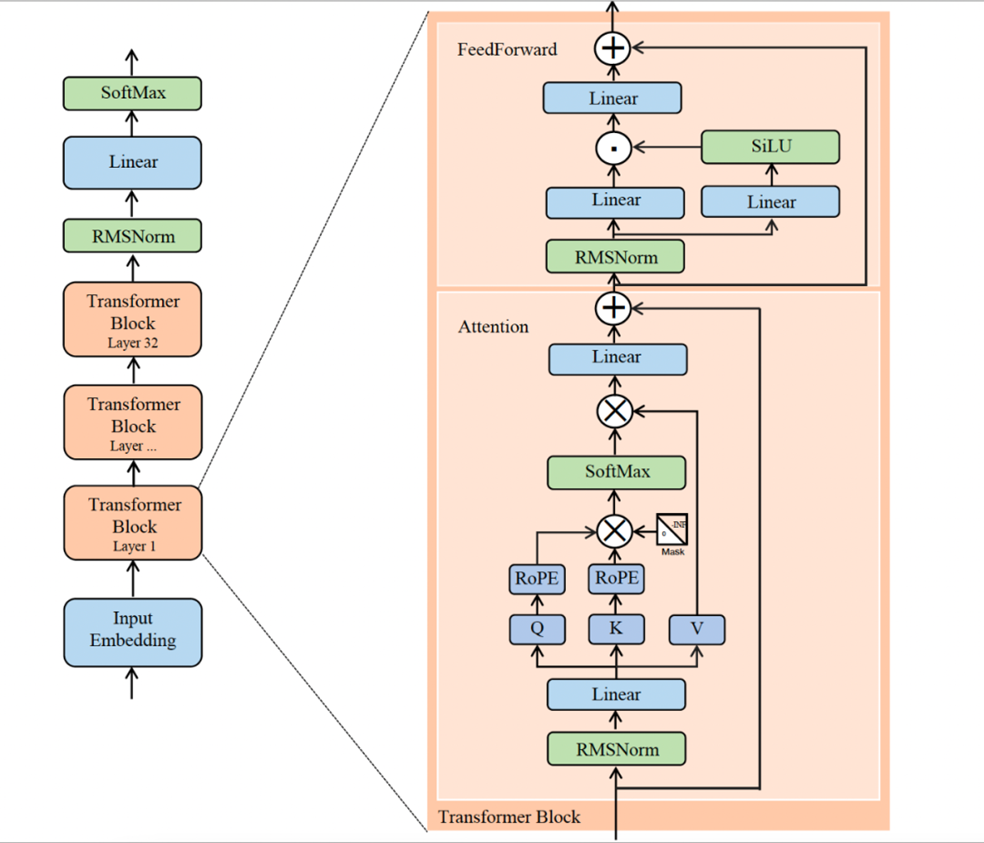
   
   
   
   主要的不同在于LLaMA2的前馈层，这里两个线性层一个经过激活函数，一个不经过激活函数，再对两者的结果进行点乘（类似LSTM中的门控机制），最后再经过一个线性层
   
   

## LLM微调

1. Lora方法

   lora的核心思想是低秩分解，即将一个大的矩阵W转化为W+AB，且保证初始化的时候BA=0(为什么？)，论文中A采用高斯初始化，B为0初始化。

   在训练过程中固定参数W，只训练BA参数。此时训练参数从d*k，降低到r *（d+k）

2. 


# 常用评价指标

1. F1分数

   ```
   p = tp/(tp+fp) = 真正例 /（真正例+假正例） 查准率：预测出的正样本有多少是正确的，当准确率高时意味着模型预测很少出错，宁可漏报，也不能误报
   r = tp/(tp+fn) = 真正例 /（真正例+假负例） 查全率：预测的正样本占全部正样本的比例，当召回率高时意味着模型能够比较好的找出正样本，宁可错报，也不能漏报
   
   f1 = 2*(p*r/p+r)
   ```

   

2. BLUE

   ```
   bleu = BP * exp(sum(wi*log(pi)))
   BP是惩罚因子，用于惩罚参考文本与翻译文本之间的长度差异
   wi是各个n-gram(连续的n个词)的权重，通常设置为均匀分布，即wi = 1/N ，N是最大的n-gram长度
   pi是n-gram的匹配率，计算翻译结果与参考文本之间的n-gram匹配数量
   ```

   

3. Rouge

   ```
   rouge主要关注召回方面的评价，衡量自动摘要与人工摘要之间的相似性。常用的有rouge-n(衡量n-gram的重叠情况),rouge-l（衡量最长公共子序列的长度）,rouge-s（衡量跨句子的重复词汇）
   
   其中rouge-l的计算方法如下：
   rouge-l = 最长公共子序列长度/参考摘要的总词数
   
   ```

   
